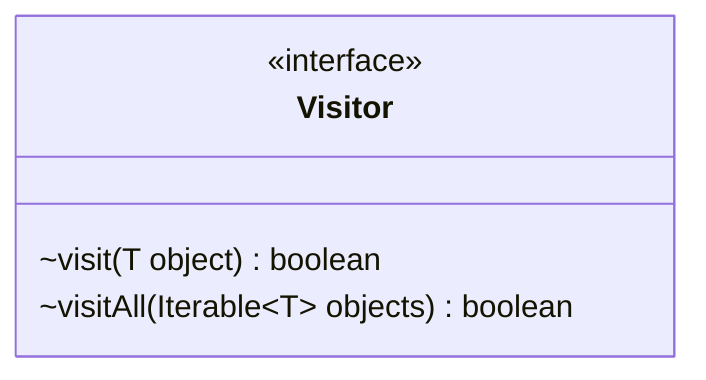

---
aliases:
  - Visitor
tags:
  - java/interface
  - module/forge-core
  - pkg/forge/util
fqn: forge.util.Visitor
package: forge.util
module: forge-core
kind: Interface
---

# Visitor

**Package:** `forge.util` &nbsp; **Module:** `forge-core` &nbsp; **Kind:** Interface



## Source
`forge-core/src/main/java/forge/util/Visitor.java`

```java
package forge.util;

public interface Visitor<T> {
    /**
     * visit the object
     * the Visitor should return true it can be visit again
     * returning false means the outer function can stop
     *
     * @param object
     * @return boolean
     */
    boolean visit(T object);

    default boolean visitAll(Iterable<? extends T> objects) {
        for (T obj : objects) {
            if (!visit(obj)) {
                return false;
            }
        }
        return true;
    }
}
```
