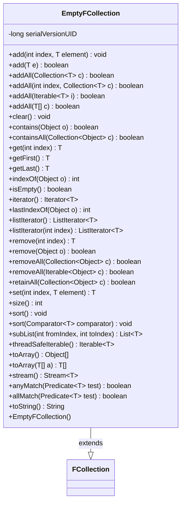

---
aliases:
  - EmptyFCollection
tags:
  - java/class
  - module/forge-core
  - pkg/forge/util/collect
fqn: forge.util.collect.FCollection.EmptyFCollection
package: forge.util.collect
module: forge-core
kind: Class
---

# EmptyFCollection

**Package:** `forge.util.collect` &nbsp; **Module:** `forge-core` &nbsp; **Kind:** Class



## Relationships
**Extends:**
- [[forge.util.collect.FCollection|FCollection]]

## Source
`forge-core/src/main/java/forge/util/collect/FCollection.java` — declaration excerpt

```java
    /**
     * An unmodifiable, empty {@link FCollection}. Overrides all methods with
     * default implementations suitable for an empty collection, to improve
     * performance.
     */
    public static class EmptyFCollection<T> extends FCollection<T> {
        private static final long serialVersionUID = 8667965158891635997L;
        public EmptyFCollection() {
            super();
        }
        @Override public final void add(final int index, final T element) {
        }
        @Override public final boolean add(final T e) {
            return false;
        }
        @Override public final boolean addAll(final Collection<? extends T> c) {
            return false;
        }
        @Override public final boolean addAll(final int index, final Collection<? extends T> c) {
            return false;
        }
        @Override public final boolean addAll(final Iterable<? extends T> i) {
            return false;
        }
        @Override public final boolean addAll(final T[] c) {
            return false;
        }
        @Override public final void clear() {
        }
        @Override public final boolean contains(final Object o) {
            return false;
        }
        @Override public final boolean containsAll(final Collection<?> c) {
            return c.isEmpty();
        }
        @Override public final T get(final int index) {
            throw new IndexOutOfBoundsException("Any index is out of bounds for an empty collection");
        }
        @Override public final T getFirst() {
            throw new NoSuchElementException("Collection is empty");
        }
        @Override public final T getLast() {
            throw new NoSuchElementException("Collection is empty");
        }
        @Override public final int indexOf(final Object o) {
            return -1;
        }
        @Override public final boolean isEmpty() {
            return true;
        }
        @Override public final Iterator<T> iterator() {
            return Collections.emptyIterator();
        }
        @Override public final int lastIndexOf(final Object o) {
            return -1;
        }
        @Override public final ListIterator<T> listIterator() {
            return Collections.emptyListIterator();
        }
        @Override public final ListIterator<T> listIterator(final int index) {
            return Collections.emptyListIterator();
        }
        @Override public final T remove(final int index) {
            throw new IndexOutOfBoundsException("Any index is out of bounds for an empty collection");
        }
        @Override public final boolean remove(final Object o) {
            return false;
        }
        @Override public boolean removeAll(final Collection<?> c) {
            return false;
        }
        @Override public final boolean removeAll(final Iterable<?> c) {
            return false;
        }
        @Override public final boolean retainAll(final Collection<?> c) {
            return false;
        }
        @Override public final T set(final int index, final T element) {
            throw new IndexOutOfBoundsException("Any index is out of bounds for an empty collection");
        }
        @Override public final int size() {
            return 0;
        }
        @Override public final void sort() {
        }
        @Override public final void sort(final Comparator<? super T> comparator) {
        }
        @Override public final List<T> subList(final int fromIndex, final int toIndex) {
            if (fromIndex == 0 && toIndex == 0) {
                return this;
            }
            throw new IndexOutOfBoundsException("Any index is out of bounds for an empty collection");
        }
        @Override public final Iterable<T> threadSafeIterable() {
            return this;
        }
        @Override public final Object[] toArray() { return ArrayUtils.EMPTY_OBJECT_ARRAY; }
        @Override
        @SuppressWarnings("hiding")
        public final <T> T[] toArray(final T[] a) {
            if (a.length > 0) {
                a[0] = null;
            }
            return a;
        }

        @Override public Stream<T> stream() {return Stream.empty();}
        @Override public boolean anyMatch(Predicate<? super T> test) {return false;}
        @Override public boolean allMatch(Predicate<? super T> test) {return true;}

        @Override
        public final String toString() {
            return "[]";
        }
    }
```
