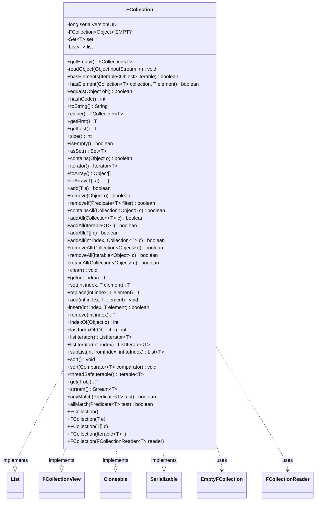

---
aliases:
  - FCollection
tags:
  - java/class
  - module/forge-core
  - pkg/forge/util/collect
fqn: forge.util.collect.FCollection
package: forge.util.collect
module: forge-core
kind: Class
---

# FCollection

**Package:** `forge.util.collect` &nbsp; **Module:** `forge-core` &nbsp; **Kind:** Class



## Relationships
**Implements:**
- [[forge.util.collect.FCollectionView|FCollectionView]]
**Uses:**
- [[forge.util.collect.FCollection.EmptyFCollection|EmptyFCollection]]
- [[forge.util.collect.FCollectionReader|FCollectionReader]]

## Design Description

FCollection is a generic collection that combines the uniqueness guarantee of a Set with the insertion-order preservation and positional access of a List, backed by parallel `HashSet` and `ArrayList` fields kept in sync on every mutation. It implements `List<T>`, the read-oriented `FCollectionView<T>`, `Cloneable`, and `Serializable`, serving as Forge's standard ordered, duplicate-free container. The set backs membership and size queries while the list backs ordering and indexed operations, and the transient set is rebuilt from the list on deserialization.

Convenience constructors accept single elements, arrays, iterables, or an `FCollectionReader`, and null elements are silently rejected. Equality and hashing delegate to the backing list. A shared immutable `EMPTY` singleton, implemented by the nested `EmptyFCollection` subclass, overrides every mutator and accessor with optimized no-op or empty-result behavior to avoid allocating throwaway empty instances.

## Source
`forge-core/src/main/java/forge/util/collect/FCollection.java`

```java
package forge.util.collect;

import java.io.IOException;
import java.io.ObjectInputStream;
import java.io.Serializable;
import java.util.*;
import java.util.function.Predicate;
import java.util.stream.Stream;

import org.apache.commons.lang3.ArrayUtils;

import com.google.common.collect.ImmutableList;
import com.google.common.collect.Iterables;
import com.google.common.collect.Lists;
import com.google.common.collect.Ordering;

/**
 * Collection with unique elements ({@link Set}) that maintains the order in
 * which the elements are added to it ({@link List}).
 *
 * This object is serializable if all elements it contains are.
 *
 * @param <T> the type of the elements this collection contains.
 * @see FCollectionView
 */
public class FCollection<T> implements List<T>, /*Set<T>,*/ FCollectionView<T>, Cloneable, Serializable {
    private static final long serialVersionUID = -1664555336364294106L;

    private static final FCollection<?> EMPTY = new EmptyFCollection<>();

    @SuppressWarnings("unchecked")
    public static <T> FCollection<T> getEmpty() {
        return (FCollection<T>) EMPTY;
    }

    /**
     * The {@link Set} representation of this collection.
     */
    private transient Set<T> set = new HashSet<>();

    /**
     * The {@link List} representation of this collection.
     */
    private final List<T> list = new ArrayList<>();

    /**
     * Rebuild the transient set from the list after deserialization.
     */
    private void readObject(ObjectInputStream in) throws IOException, ClassNotFoundException {
        in.defaultReadObject();
        set = new HashSet<>(list);
    }

    /**
     * Create an empty {@link FCollection}.
     */
    public FCollection() {
    }

    /**
     * Create an {@link FCollection} containing a single element.
     *
     * @param e the single element the new collection contains.
     */
    public FCollection(final T e) {
        add(e);
    }

    /**
     * Create an {@link FCollection} from an array. The order of the elements in
     * the array is preserved in the new collection.
     *
     * @param c an array, whose elements will be in the collection upon its
     *            creation.
     */
    public FCollection(final T[] c) {
        this.addAll(Arrays.asList(c));
    }

    /**
     * Create an {@link FCollection} from an {@link Iterable}. The order of the
     * elements in the iterable is preserved in the new collection.
     *
     * @param i an iterable, whose elements will be in the collection upon its
     *            creation.
     */
    public FCollection(final Iterable<? extends T> i) {
        this.addAll(i);
    }

    /**
     * Create an {@link FCollection} from an {@link FCollectionReader}.
     *
     * @param reader a reader used to populate collection
     */
    public FCollection(final FCollectionReader<T> reader) {
        reader.readAll(this);
    }

    /**
     * Check whether an {@link Iterable} contains any iterable, silently
     * returning {@code false} when {@code null} is passed as an argument.
     *
     * @param iterable a card collection.
     */
    public static boolean hasElements(final Iterable<?> iterable) {
        return iterable != null && !Iterables.isEmpty(iterable);
    }

    /**
     * Check whether a {@link Collection} contains a particular element, silently
     * returning {@code false} when {@code null} is passed as the first argument.
     *
     * @param collection a collection.
     * @param element a possible element of the collection.
     */
    public static <T> boolean hasElement(final Collection<T> collection, final T element) {
        return collection != null && collection.contains(element);
    }

    /**
     * {@inheritDoc}
     */
    @Override
    public boolean equals(final Object obj) {
        return obj instanceof FCollection && hashCode() == obj.hashCode();
    }

    /**
     * <p>This implementation uses the hash code of the backing list.</p>
     *
     * {@inheritDoc}
     */
    @Override
    public int hashCode() {
        return list.hashCode();
    }

    /**
     * Return a string representation of this {@link FCollection}, by
     * concatenating the elements, in order, using a comma {@code ,}, and
     * wrapping it in brackets {@code [ ]}.
     */
    @Override
    public String toString() {
        return list.toString();
    }

    /**
     * Create a new {@link FCollection} containing the same objects as this
     * instance, in the same order. Note that objects are shallowly copied.
     */
    @Override
    public final FCollection<T> clone() {
        return new FCollection<>(list);
    }

    /**
     * Get the first object in this {@link FCollection}.
     */
    @Override
    public T getFirst() {
        if (list.isEmpty())
            return null;
        return list.get(0);
        //return list.getFirst();
    }

    /**
     * Get the last object in this {@link FCollection}.
     */
    @Override
    public T getLast() {
        if (list.isEmpty())
            return null;
        return list.get(list.size() - 1);
        //return list.getLast();
    }

    /**
     * Get the number of elements in this collection.
     */
    @Override
    public int size() {
        return set.size();
    }

    /**
     * Check whether this collection is empty.
     */
    @Override
    public boolean isEmpty() {
        return set.isEmpty();
    }

    public Set<T> asSet() {
        return set;
    }

    /**
     * Check whether this collection contains a particular object.
     *
     * @param o an object.
     */
    @Override
    public boolean contains(final Object o) {
        if (o == null)
            return false;
        return set.contains(o);
    }

    /**
     * {@inheritDoc}
     */
    @Override
    public Iterator<T> iterator() {
        return list.iterator();
    }

    /**
     * {@inheritDoc}
     */
    @Override
    public Object[] toArray() {
        return list.toArray();
    }

    /**
     * {@inheritDoc}
     */
    @Override
    @SuppressWarnings("hiding")
    public <T> T[] toArray(final T[] a) {
        return list.toArray(a);
    }

    /**
     * Add an element to this collection, if it isn't already present.
     *
     * @param e the object to add.
     *
     * @return whether the collection changed as a result of this method call.
     */
    @Override
    public boolean add(final T e) {
        if (e == null)
            return false;
        if (set.add(e)) {
            list.add(e);
            return true;
        }
        return false;
    }

    /**
     * Remove an element from this collection.
     *
     * @param o the object to remove.
     *
     * @return whether the collection changed as a result of this method call.
     */
    @Override
    public boolean remove(final Object o) {
        if (o == null)
            return false;
        if (set.remove(o)) {
            list.remove(o);
            return true;
        }
        return false;
    }

    @Override
    public boolean removeIf(Predicate<? super T> filter) {
        if (list.removeIf(filter)) {
            set.removeIf(filter);
            return true;
        }
        return false;
    }

    /**
     * {@inheritDoc}
     */
    @Override
    public boolean containsAll(final Collection<?> c) {
        return set.containsAll(c);
    }

    /**
     * {@inheritDoc}
     */
    @Override
    public boolean addAll(final Collection<? extends T> c) {
        return addAll((Iterable<? extends T>) c);
    }

    /**
     * Add all the elements in the specified {@link Iterator} to this
     * collection, in the order in which they appear.
     *
     * @param i an iterator.
     *
     * @return whether this collection changed as a result of this method call.
     * @see #addAll(Collection)
     */
    public boolean addAll(final Iterable<? extends T> i) {
        boolean changed = false;
        if (i == null)
            return false;
        for (final T e : i) {
            changed |= add(e);
        }
        return changed;
    }

    /**
     * Add all the elements in the specified array to this collection,
     * respecting the ordering.
     *
     * @param c an array.
     *
     * @return whether this collection changed as a result of this method call.
     */
    public boolean addAll(final T[] c) {
        boolean changed = false;
        for (final T e : c) {
            changed |= add(e);
        }
        return changed;
    }

    /**
     * {@inheritDoc}
     */
    @SuppressWarnings("unchecked")
    @Override
    public boolean addAll(final int index, final Collection<? extends T> c) {
        if (c == null) {
            return false;
        }

        final List<? extends T> list;
        if (c instanceof List) {
            list = (List<T>) c;
        } else {
            list = Lists.newArrayList(c);
        }

        boolean changed = false;
        for (int i = list.size() - 1; i >= 0; i--) { //must add in reverse order so they show up in the right place
            changed |= insert(index, list.get(i));
        }
        return changed;
    }

    /**
     * {@inheritDoc}
     */
    @Override
    public boolean removeAll(final Collection<?> c) {
        return removeAll((Iterable<?>) c);
    }

    /**
     * Remove all objects appearing in an {@link Iterable}.
     *
     * @param c an iterable.
     *
     * @return whether this collection changed as a result of this method call.
     */
    public boolean removeAll(final Iterable<?> c) {
        boolean changed = false;
        if (c == null)
            return false;
        for (final Object o : c) {
            changed |= remove(o);
        }
        return changed;
    }

    /**
     * {@inheritDoc}
     */
    @Override
    public boolean retainAll(final Collection<?> c) {
        if (set.retainAll(c)) {
            list.retainAll(c);
            return true;
        }
        return false;
    }

    /**
     * {@inheritDoc}
     */
    @Override
    public void clear() {
        if (set.isEmpty()) { return; }
        set.clear();
        list.clear();
    }

    /**
     * {@inheritDoc}
     */
    @Override
    public T get(final int index) {
        return list.get(index);
    }

    /**
     * Set the element at an index to a value. WARNING: this method doesn't
     * update the set and should only be used in a situation where the set of
     * elements in this collection is invariant.
     */
    @Override
    public T set(final int index, final T element) { //assume this isn't called except when changing list order, so don't worry about updating set
        return list.set(index, element);
    }

    /**
     * Replace the element at the specified position, updating both the
     * internal list and set. Unlike {@link #set}, this keeps set membership
     * in sync with the list.
     */
    public T replace(final int index, final T element) {
        final T old = list.set(index, element);
        if (old != element) {
            set.remove(old);
            set.add(element);
        }
        return old;
    }

    /**
     * {@inheritDoc}
     */
    @Override
    public void add(final int index, final T element) {
        insert(index, element);
    }

    /**
     * Helper method to insert an element at a particular index.
     *
     * @param index the index to insert the element at.
     *
     * @param element the element to insert.
     *
     * @return whether this collection changed as a result of this method call.
     */
    private boolean insert(int index, final T element) {
        if (set.add(element)) {
            list.add(index, element);
            return true;
        }
        //re-position in list if needed
        final int oldIndex = list.indexOf(element);
        if (index == oldIndex) {
            return false;
        }

        if (index > oldIndex) {
            index--; //account for being removed
        }
        list.remove(oldIndex);
        list.add(index, element);
        return true;
    }

    /**
     * {@inheritDoc}
     */
    @Override
    public T remove(final int index) {
        final T removedItem = list.remove(index);
        if (removedItem != null) {
            set.remove(removedItem);
        }
        return removedItem;
    }

    /**
     * {@inheritDoc}
     */
    @Override
    public int indexOf(final Object o) {
        return list.indexOf(o);
    }

    /**
     * {@inheritDoc}
     */
    @Override
    public int lastIndexOf(final Object o) {
        return list.lastIndexOf(o);
    }

    /**
     * {@inheritDoc}
     */
    @Override
    public ListIterator<T> listIterator() {
        return list.listIterator();
    }

    /**
     * {@inheritDoc}
     */
    @Override
    public ListIterator<T> listIterator(final int index) {
        return list.listIterator(index);
    }

    /**
     * <p>
     * <b>Note</b> This method breaks the contract of {@link List#subList(int, int)}
     * by returning a static collection, rather than a view, of the sublist.
     * </p>
     *
     * {@inheritDoc}
     */
    @Override
    public List<T> subList(final int fromIndex, final int toIndex) {
        return ImmutableList.copyOf(list.subList(fromIndex, toIndex));
    }

    /**
     * Sort this collection on the string representations of the resepctive
     * elements.
     *
     * @see Object#toString()
     * @see #sort(Comparator)
     * @see Ordering#usingToString()
     */
    public void sort() {
        sort(Ordering.usingToString());
    }

    /**
     * {@inheritDoc}
     */
    public void sort(final Comparator<? super T> comparator) {
        try {
            list.sort(comparator);
        } catch (Exception e) {
            System.err.println("FCollection failed to sort: \n" + comparator + "\n" + e.getMessage());
        }
    }

    /**
     * {@inheritDoc}
     */
    @Override
    public Iterable<T> threadSafeIterable() {
        //create a new list for iterating to make it thread safe and avoid concurrent modification exceptions
        return Iterables.unmodifiableIterable(new ArrayList<>(list));
    }

    @Override
    public T get(final T obj) {
        if (obj == null) {
            return null;
        }
        for(T x : this) {
            if (x.equals(obj)) {
                return x;
            }
        }
        return obj;
    }

    @Override
    public Stream<T> stream() {
        return list.stream();
    }

    @Override
    public boolean anyMatch(Predicate<? super T> test) {
        return set.stream().anyMatch(test);
    }

    @Override
    public boolean allMatch(Predicate<? super T> test) {
        return set.stream().allMatch(test);
    }

    /**
     * An unmodifiable, empty {@link FCollection}. Overrides all methods with
     * default implementations suitable for an empty collection, to improve
     * performance.
     */
    public static class EmptyFCollection<T> extends FCollection<T> {
        private static final long serialVersionUID = 8667965158891635997L;
        public EmptyFCollection() {
            super();
        }
        @Override public final void add(final int index, final T element) {
        }
        @Override public final boolean add(final T e) {
            return false;
        }
        @Override public final boolean addAll(final Collection<? extends T> c) {
            return false;
        }
        @Override public final boolean addAll(final int index, final Collection<? extends T> c) {
            return false;
        }
        @Override public final boolean addAll(final Iterable<? extends T> i) {
            return false;
        }
        @Override public final boolean addAll(final T[] c) {
            return false;
        }
        @Override public final void clear() {
        }
        @Override public final boolean contains(final Object o) {
            return false;
        }
        @Override public final boolean containsAll(final Collection<?> c) {
            return c.isEmpty();
        }
        @Override public final T get(final int index) {
            throw new IndexOutOfBoundsException("Any index is out of bounds for an empty collection");
        }
        @Override public final T getFirst() {
            throw new NoSuchElementException("Collection is empty");
        }
        @Override public final T getLast() {
            throw new NoSuchElementException("Collection is empty");
        }
        @Override public final int indexOf(final Object o) {
            return -1;
        }
        @Override public final boolean isEmpty() {
            return true;
        }
        @Override public final Iterator<T> iterator() {
            return Collections.emptyIterator();
        }
        @Override public final int lastIndexOf(final Object o) {
            return -1;
        }
        @Override public final ListIterator<T> listIterator() {
            return Collections.emptyListIterator();
        }
        @Override public final ListIterator<T> listIterator(final int index) {
            return Collections.emptyListIterator();
        }
        @Override public final T remove(final int index) {
            throw new IndexOutOfBoundsException("Any index is out of bounds for an empty collection");
        }
        @Override public final boolean remove(final Object o) {
            return false;
        }
        @Override public boolean removeAll(final Collection<?> c) {
            return false;
        }
        @Override public final boolean removeAll(final Iterable<?> c) {
            return false;
        }
        @Override public final boolean retainAll(final Collection<?> c) {
            return false;
        }
        @Override public final T set(final int index, final T element) {
            throw new IndexOutOfBoundsException("Any index is out of bounds for an empty collection");
        }
        @Override public final int size() {
            return 0;
        }
        @Override public final void sort() {
        }
        @Override public final void sort(final Comparator<? super T> comparator) {
        }
        @Override public final List<T> subList(final int fromIndex, final int toIndex) {
            if (fromIndex == 0 && toIndex == 0) {
                return this;
            }
            throw new IndexOutOfBoundsException("Any index is out of bounds for an empty collection");
        }
        @Override public final Iterable<T> threadSafeIterable() {
            return this;
        }
        @Override public final Object[] toArray() { return ArrayUtils.EMPTY_OBJECT_ARRAY; }
        @Override
        @SuppressWarnings("hiding")
        public final <T> T[] toArray(final T[] a) {
            if (a.length > 0) {
                a[0] = null;
            }
            return a;
        }

        @Override public Stream<T> stream() {return Stream.empty();}
        @Override public boolean anyMatch(Predicate<? super T> test) {return false;}
        @Override public boolean allMatch(Predicate<? super T> test) {return true;}

        @Override
        public final String toString() {
            return "[]";
        }
    }
}
```

## Python
`forge/util/collect/FCollection.py`

```python
from functools import cmp_to_key
import sys

from forge.util.collect.FCollectionView import FCollectionView
from forge.util.collect.FCollectionReader import FCollectionReader


_MISSING = object()


class FCollection(FCollectionView):
    """
    Collection with unique elements (Set) that maintains the order in
    which the elements are added to it (List).

    This object is serializable if all elements it contains are.
    """
    serialVersionUID = -1664555336364294106

    EMPTY = None  # assigned after EmptyFCollection is defined

    @staticmethod
    def getEmpty():
        return FCollection.EMPTY

    def __init__(self, arg=_MISSING):
        # The Set representation of this collection.
        self.set = set()
        # The List representation of this collection.
        self.list = []

        if arg is _MISSING:
            # Create an empty FCollection.
            return
        if isinstance(arg, FCollectionReader):
            # Create an FCollection from an FCollectionReader.
            arg.readAll(self)
        elif isinstance(arg, (list, tuple)):
            # Create an FCollection from an array.
            self.addAll(list(arg))
        elif hasattr(arg, "__iter__") and not isinstance(arg, str):
            # Create an FCollection from an Iterable.
            self.addAll(arg)
        else:
            # Create an FCollection containing a single element.
            self.add(arg)

    def readObject(self, in_):
        # Rebuild the transient set from the list after deserialization.
        in_.defaultReadObject()
        self.set = set(self.list)

    @staticmethod
    def hasElements(iterable):
        """
        Check whether an Iterable contains any iterable, silently
        returning False when None is passed as an argument.
        """
        if iterable is None:
            return False
        for _ in iterable:
            return True
        return False

    @staticmethod
    def hasElement(collection, element):
        """
        Check whether a Collection contains a particular element, silently
        returning False when None is passed as the first argument.
        """
        return collection is not None and element in collection

    def __eq__(self, obj):
        return isinstance(obj, FCollection) and self.hashCode() == obj.hashCode()

    def hashCode(self):
        # This implementation uses the hash code of the backing list.
        return hash(tuple(self.list))

    def __hash__(self):
        return self.hashCode()

    def __str__(self):
        return str(self.list)

    def clone(self):
        # Create a new FCollection containing the same objects as this
        # instance, in the same order. Objects are shallowly copied.
        return FCollection(self.list)

    def getFirst(self):
        if not self.list:
            return None
        return self.list[0]
        # return list.getFirst();

    def getLast(self):
        if not self.list:
            return None
        return self.list[len(self.list) - 1]
        # return list.getLast();

    def size(self):
        return len(self.set)

    def isEmpty(self):
        return len(self.set) == 0

    def asSet(self):
        return self.set

    def contains(self, o):
        if o is None:
            return False
        return o in self.set

    def __iter__(self):
        return iter(self.list)

    def iterator(self):
        return iter(self.list)

    def toArray(self, a=None):
        if a is None:
            return list(self.list)
        return list(self.list)

    def add(self, *args):
        if len(args) == 2:
            # add(int index, T element)
            index, element = args
            self.insert(index, element)
            return
        # add(T e)
        e = args[0]
        if e is None:
            return False
        if e not in self.set:
            self.set.add(e)
            self.list.append(e)
            return True
        return False

    def remove(self, o):
        if isinstance(o, int):
            # remove(int index)
            removedItem = self.list.pop(o)
            if removedItem is not None:
                self.set.discard(removedItem)
            return removedItem
        # remove(Object o)
        if o is None:
            return False
        if o in self.set:
            self.set.discard(o)
            self.list.remove(o)
            return True
        return False

    def removeIf(self, filter):
        to_remove = [x for x in self.list if filter(x)]
        if to_remove:
            for x in to_remove:
                self.list.remove(x)
            for x in to_remove:
                self.set.discard(x)
            return True
        return False

    def containsAll(self, c):
        return all(x in self.set for x in c)

    def addAll(self, *args):
        if len(args) == 2:
            # addAll(int index, Collection<? extends T> c)
            index, c = args
            if c is None:
                return False
            if isinstance(c, list):
                lst = c
            else:
                lst = list(c)
            changed = False
            for i in range(len(lst) - 1, -1, -1):  # must add in reverse order so they show up in the right place
                changed |= self.insert(index, lst[i])
            return changed

        # addAll(Collection) / addAll(Iterable) / addAll(T[])
        i = args[0]
        changed = False
        if i is None:
            return False
        for e in i:
            changed |= self.add(e)
        return changed

    def removeAll(self, c):
        # removeAll(Collection) / removeAll(Iterable)
        changed = False
        if c is None:
            return False
        for o in c:
            changed |= self.remove(o)
        return changed

    def retainAll(self, c):
        new = [x for x in self.set if x in c]
        if len(new) != len(self.set):
            self.set = set(new)
            self.list[:] = [x for x in self.list if x in c]
            return True
        return False

    def clear(self):
        if not self.set:
            return
        self.set.clear()
        self.list.clear()

    def get(self, x):
        if isinstance(x, int):
            # get(int index)
            return self.list[x]
        # get(T obj)
        if x is None:
            return None
        for elem in self:
            if elem == x:
                return elem
        return x

    def set(self, index, element):
        # WARNING: this method doesn't update the set and should only be used
        # in a situation where the set of elements in this collection is invariant.
        old = self.list[index]
        self.list[index] = element
        return old

    def replace(self, index, element):
        # Replace the element at the specified position, updating both the
        # internal list and set, keeping set membership in sync with the list.
        old = self.list[index]
        self.list[index] = element
        if old is not element:
            self.set.discard(old)
            self.set.add(element)
        return old

    def insert(self, index, element):
        # Helper method to insert an element at a particular index.
        if element not in self.set:
            self.set.add(element)
            self.list.insert(index, element)
            return True
        # re-position in list if needed
        oldIndex = self.list.index(element)
        if index == oldIndex:
            return False
        if index > oldIndex:
            index -= 1  # account for being removed
        self.list.pop(oldIndex)
        self.list.insert(index, element)
        return True

    def indexOf(self, o):
        try:
            return self.list.index(o)
        except ValueError:
            return -1

    def lastIndexOf(self, o):
        for i in range(len(self.list) - 1, -1, -1):
            if self.list[i] == o:
                return i
        return -1

    def listIterator(self, index=None):
        if index is None:
            return iter(self.list)
        return iter(self.list[index:])

    def subList(self, fromIndex, toIndex):
        # Note: this breaks the contract of List.subList by returning a static
        # collection, rather than a view, of the sublist.
        return list(self.list[fromIndex:toIndex])

    def sort(self, comparator=None):
        if comparator is None:
            # Ordering.usingToString()
            self.sort(_using_to_string)
            return
        try:
            self.list.sort(key=cmp_to_key(comparator))
        except Exception as e:
            sys.stderr.write("FCollection failed to sort: \n" + str(comparator) + "\n" + str(e) + "\n")

    def threadSafeIterable(self):
        # create a new list for iterating to make it thread safe and avoid
        # concurrent modification exceptions
        return list(self.list)

    def stream(self):
        return iter(self.list)

    def anyMatch(self, test):
        return any(test(x) for x in self.set)

    def allMatch(self, test):
        return all(test(x) for x in self.set)


def _using_to_string(a, b):
    sa, sb = str(a), str(b)
    return (sa > sb) - (sa < sb)


class EmptyFCollection(FCollection):
    """
    An unmodifiable, empty FCollection. Overrides all methods with default
    implementations suitable for an empty collection, to improve performance.
    """
    serialVersionUID = 8667965158891635997

    def __init__(self):
        super().__init__()

    def add(self, *args):
        if len(args) == 2:
            # add(int index, T element)
            return
        return False

    def addAll(self, *args):
        return False

    def clear(self):
        return

    def contains(self, o):
        return False

    def containsAll(self, c):
        for _ in c:
            return False
        return True

    def get(self, x):
        if isinstance(x, int):
            raise IndexError("Any index is out of bounds for an empty collection")
        if x is None:
            return None
        return x

    def getFirst(self):
        raise Exception("Collection is empty")

    def getLast(self):
        raise Exception("Collection is empty")

    def indexOf(self, o):
        return -1

    def isEmpty(self):
        return True

    def __iter__(self):
        return iter([])

    def iterator(self):
        return iter([])

    def lastIndexOf(self, o):
        return -1

    def listIterator(self, index=None):
        return iter([])

    def remove(self, o):
        if isinstance(o, int):
            raise IndexError("Any index is out of bounds for an empty collection")
        return False

    def removeAll(self, c):
        return False

    def retainAll(self, c):
        return False

    def set(self, index, element):
        raise IndexError("Any index is out of bounds for an empty collection")

    def size(self):
        return 0

    def sort(self, comparator=None):
        return

    def subList(self, fromIndex, toIndex):
        if fromIndex == 0 and toIndex == 0:
            return self
        raise IndexError("Any index is out of bounds for an empty collection")

    def threadSafeIterable(self):
        return self

    def toArray(self, a=None):
        if a is None:
            return []
        if len(a) > 0:
            a[0] = None
        return a

    def stream(self):
        return iter([])

    def anyMatch(self, test):
        return False

    def allMatch(self, test):
        return True

    def __str__(self):
        return "[]"


FCollection.EmptyFCollection = EmptyFCollection
FCollection.EMPTY = EmptyFCollection()
```
