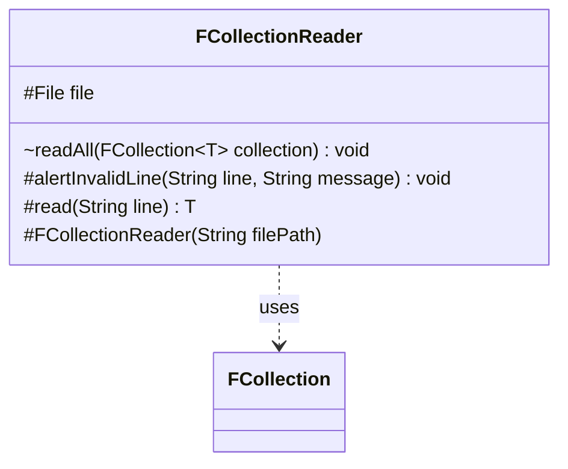

---
aliases:
  - FCollectionReader
tags:
  - java/class
  - module/forge-core
  - pkg/forge/util/collect
fqn: forge.util.collect.FCollectionReader
package: forge.util.collect
module: forge-core
kind: Class
---

# FCollectionReader

**Package:** `forge.util.collect` &nbsp; **Module:** `forge-core` &nbsp; **Kind:** Class



## Relationships
**Uses:**
- [[forge.util.collect.FCollection|FCollection]]

## Design Description

FCollectionReader is an abstract template for loading a typed FCollection from a text file. Its constructor binds a File from the given path, and the package-private readAll drives the load: it reads each line via FileUtil, trims and skips blank lines, delegates parsing to the abstract read hook, and adds any non-null result to the supplied FCollection. Subclasses supply the per-line parsing logic by implementing read, while alertInvalidLine offers a shared way to report malformed input to standard error with the offending line and file path.

As a generic Template Method base, it cleanly separates the invariant file-reading and collection-population loop from the format-specific parsing it defers to concrete readers. It collaborates with FCollection as the population target, treating null parse results as skippable so subclasses can silently reject unrecognized lines.

## Source
`forge-core/src/main/java/forge/util/collect/FCollectionReader.java`

```java
package forge.util.collect;

import forge.util.FileUtil;

import java.io.File;

public abstract class FCollectionReader<T> {
    protected final File file;

    protected FCollectionReader(String filePath) {
        file = new File(filePath);
    }

    void readAll(FCollection<T> collection) {
        for (String line : FileUtil.readFile(file)) {
            line = line.trim();
            if (line.isEmpty()) {
                continue; //ignore blank or whitespace lines
            }

            T item = read(line);
            if (item != null) {
                collection.add(item);
            }
        }
    }

    protected void alertInvalidLine(String line, String message) {
        System.err.println(message);
        System.err.println(line);
        System.err.println(file.getPath());
        System.err.println();
    }

    protected abstract T read(String line);
}
```

## Python
`forge/util/collect/FCollectionReader.py`

```python
package = None

from forge.util.collect.FCollection import FCollection
from forge.util.FileUtil import FileUtil

import os


class FCollectionReader:
    def __init__(self, filePath: str):
        self.file = filePath

    def readAll(self, collection: "FCollection"):
        for line in FileUtil.readFile(self.file):
            line = line.strip()
            if not line:
                continue  # ignore blank or whitespace lines

            item = self.read(line)
            if item is not None:
                collection.add(item)

    def alertInvalidLine(self, line: str, message: str):
        import sys
        print(message, file=sys.stderr)
        print(line, file=sys.stderr)
        print(self.file, file=sys.stderr)
        print(file=sys.stderr)

    def read(self, line: str):
        raise NotImplementedError
```
