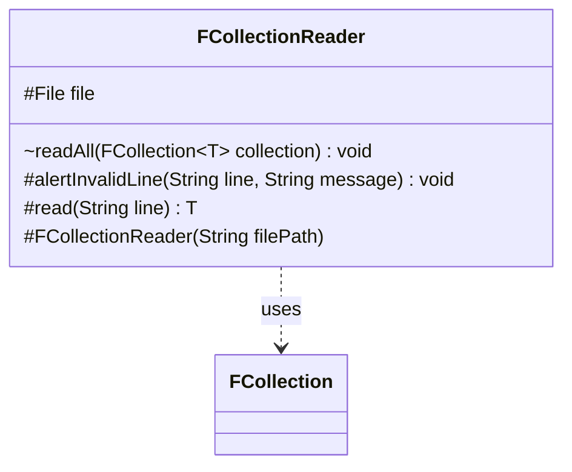

---
aliases:
  - FCollectionReader
tags:
  - java/class
  - module/forge-core
  - pkg/forge/util/collect
fqn: forge.util.collect.FCollectionReader
package: forge.util.collect
module: forge-core
kind: Class
---

# FCollectionReader

**Package:** `forge.util.collect` &nbsp; **Module:** `forge-core` &nbsp; **Kind:** Class



## Relationships
**Uses:**
- [[forge.util.collect.FCollection|FCollection]]

## Source
`forge-core/src/main/java/forge/util/collect/FCollectionReader.java`

```java
package forge.util.collect;

import forge.util.FileUtil;

import java.io.File;

public abstract class FCollectionReader<T> {
    protected final File file;

    protected FCollectionReader(String filePath) {
        file = new File(filePath);
    }

    void readAll(FCollection<T> collection) {
        for (String line : FileUtil.readFile(file)) {
            line = line.trim();
            if (line.isEmpty()) {
                continue; //ignore blank or whitespace lines
            }

            T item = read(line);
            if (item != null) {
                collection.add(item);
            }
        }
    }

    protected void alertInvalidLine(String line, String message) {
        System.err.println(message);
        System.err.println(line);
        System.err.println(file.getPath());
        System.err.println();
    }

    protected abstract T read(String line);
}
```
