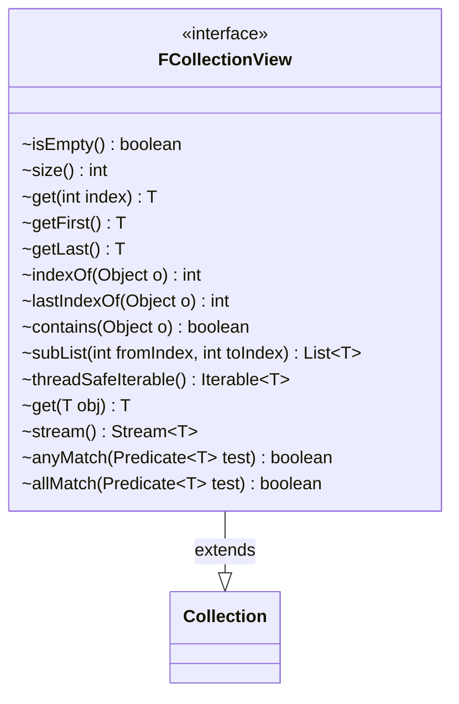

---
aliases:
  - FCollectionView
tags:
  - java/interface
  - module/forge-core
  - pkg/forge/util/collect
fqn: forge.util.collect.FCollectionView
package: forge.util.collect
module: forge-core
kind: Interface
---

# FCollectionView

**Package:** `forge.util.collect` &nbsp; **Module:** `forge-core` &nbsp; **Kind:** Interface



## Source
`forge-core/src/main/java/forge/util/collect/FCollectionView.java`

```java
package forge.util.collect;

import java.util.Collection;
import java.util.List;
import java.util.NoSuchElementException;
import java.util.function.Predicate;
import java.util.stream.Stream;

/**
 * Read-only interface to an {@link FCollection}.
 */
public interface FCollectionView<T> extends Collection<T> {
    /**
     * @see Collection#isEmpty()
     */
    boolean isEmpty();

    /**
     * @see Collection#size()
     */
    int size();

    /**
     * @see List#get(int)
     */
    T get(int index);

    /**
     * Get the first object in this {@link FCollectionView}.
     *
     * @throws NoSuchElementException
     *             if the collection is empty.
     */
    T getFirst();

    /**
     * Get the last object in this {@link FCollectionView}.
     *
     * @throws NoSuchElementException
     *             if the collection is empty.
     */
    T getLast();

    /**
     * @see List#indexOf(Object)
     */
    int indexOf(Object o);

    /**
     * @see List#lastIndexOf(Object)
     */
    int lastIndexOf(Object o);

    /**
     * @see Collection#contains(Object)
     */
    boolean contains(Object o);

    /**
     * Return an unmodifiable list with shallow copies of the elements in a
     * particular range of this collection.
     *
     * @param fromIndex
     *            the first index to appear in the list.
     * @param toIndex
     *            the lowest index not to appear in the list.
     * @return a sublist.
     */
    List<T> subList(int fromIndex, int toIndex);

    /**
     * Get a thread-safe {@link Iterable}, ie. one that is not backed by this
     * collection, but rather represents the state at the time this method is
     * called. The iterator is read-only (does not support
     * {@link Iterator#remove()}), as such an operation would have no meaning.
     */
    Iterable<T> threadSafeIterable();

    T get(final T obj);

    Stream<T> stream();

    /**
     * Returns true if any member of this collection matches the given predicate.
     */
    boolean anyMatch(Predicate<? super T> test);

    /**
     * Returns true if each member of this collection matches the given predicate.
     */
    boolean allMatch(Predicate<? super T> test);
}
```
