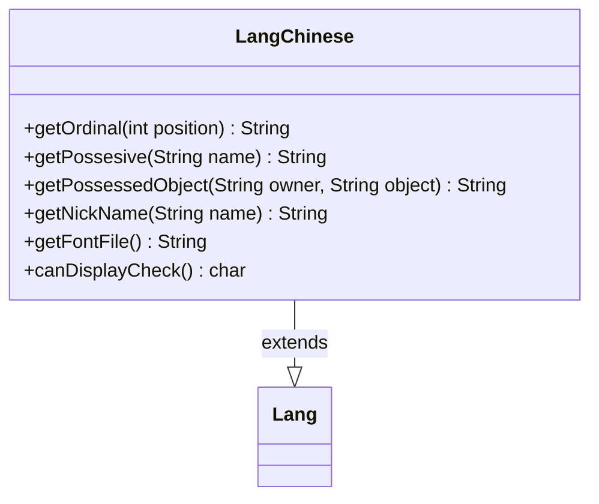

---
aliases:
  - LangChinese
tags:
  - java/class
  - module/forge-core
  - pkg/forge/util/lang
fqn: forge.util.lang.LangChinese
package: forge.util.lang
module: forge-core
kind: Class
---

# LangChinese

**Package:** `forge.util.lang`   **Module:** `forge-core`   **Kind:** Class



## Relationships
**Extends:**
- [[forge.util.Lang|Lang]]

## Design Description

LangChinese is a concrete localization strategy supplying Simplified Chinese renderings of language-dependent text used throughout Forge's UI and game messages. As a subclass of the abstract `Lang` base, it overrides the locale-specific hooks—ordinals, possessives, possessed objects, and nicknames—by appending or prefixing the appropriate Chinese characters (e.g. "第" for ordinals, "的" for possessives), while delegating compound formatting like `getPossessedObject` to its own `getPossesive` to keep grammar rules in one place. It also declares the Source Han Sans CN font via `getFontFile` and exposes a representative glyph through `canDisplayCheck`, signalling the rendering layer's need to confirm CJK font support. The design reflects Forge's pluggable per-language localization scheme, where each `Lang` subclass encapsulates one language's grammatical conventions behind a uniform interface.

## Source
`forge-core/src/main/java/forge/util/lang/LangChinese.java`

```java
package forge.util.lang;

import forge.util.Lang;

public class LangChinese extends Lang {
    
    @Override
    public String getOrdinal(final int position) {
        return "第" + position;
    }

    @Override
    public String getPossesive(final String name) {
        return name + "çš„";
    }

    @Override
    public String getPossessedObject(final String owner, final String object) {
        return getPossesive(owner) + object;
    }

    @Override
    public String getNickName(final String name) {
        return name;
    }

    @Override
    public String getFontFile() {
        return "SourceHanSansCN";
    }
    public char canDisplayCheck() {
        return '鹫';
    }
}
```

## Python
`forge/util/lang/LangChinese.py`

```python
package: forge.util.lang, fqn forge.util.lang.LangChinese, extends forge.util.Lang.

The Java source has mojibake (corrupted Chinese characters shown as `??????`). I'll preserve the literal content faithfully. Note that `canDisplayCheck()` returns a Java `char` ΓÇö a single character; Python has no char type, so it maps to `str`.

from forge.util.Lang import Lang


class LangChinese(Lang):

    def getOrdinal(self, position: int) -> str:
        return "??????" + str(position)

    def getPossesive(self, name: str) -> str:
        return name + "???????"

    def getPossessedObject(self, owner: str, object: str) -> str:
        return self.getPossesive(owner) + object

    def getNickName(self, name: str) -> str:
        return name

    def getFontFile(self) -> str:
        return "SourceHanSansCN"

    def canDisplayCheck(self) -> str:
        return '??????'
```
