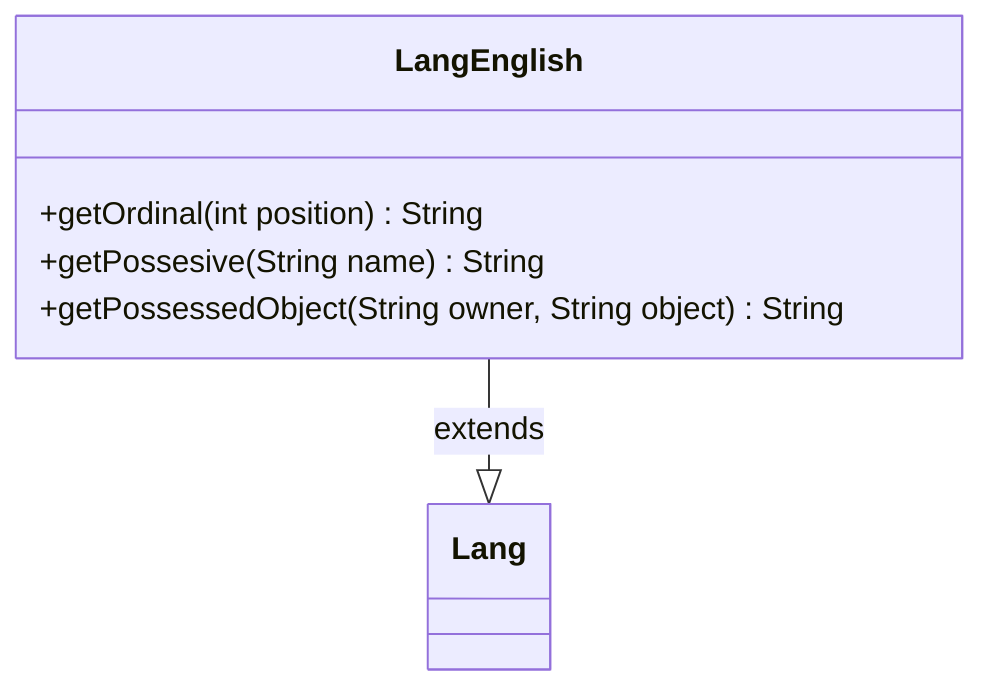

---
aliases:
  - LangEnglish
tags:
  - java/class
  - module/forge-core
  - pkg/forge/util/lang
fqn: forge.util.lang.LangEnglish
package: forge.util.lang
module: forge-core
kind: Class
---

# LangEnglish

**Package:** `forge.util.lang`   **Module:** `forge-core`   **Kind:** Class



## Relationships
**Extends:**
- [[forge.util.Lang|Lang]]

## Design Description

Forge's English-language implementation of the abstract `Lang` localization base class, providing the grammatical rules needed to render player-facing text correctly in English. By overriding `getOrdinal`, `getPossesive`, and `getPossessedObject`, it encodes language-specific conventions—ordinal suffixes (1st, 2nd, 3rd, 11th–13th as special cases), possessive apostrophes (handling trailing "s" and the irregular "You"→"your"), and the composition of an owner with a possessed object.

The design follows a strategy/template pattern: `Lang` defines the abstract contract that callers depend on, while `LangEnglish` supplies one concrete, swappable locale implementation. This keeps grammar logic isolated per language, letting the engine select the appropriate `Lang` subtype without embedding English-specific assumptions in calling code.

## Source
`forge-core/src/main/java/forge/util/lang/LangEnglish.java`

```java
package forge.util.lang;

import forge.util.Lang;

public class LangEnglish extends Lang {
    
    @Override
    public String getOrdinal(final int position) {
        final String[] sufixes = new String[] { "th", "st", "nd", "rd", "th", "th", "th", "th", "th", "th" };
        switch (position % 100) {
        case 11:
        case 12:
        case 13:
            return position + "th";
        default:
            return position + sufixes[position % 10];
        }
    }

    @Override
    public String getPossesive(final String name) {
        if ("You".equalsIgnoreCase(name)) {
            return name + "r"; // to get "your"
        }
        return name.endsWith("s") ? name + "'" : name + "'s";
    }

    @Override
    public String getPossessedObject(final String owner, final String object) {
        return getPossesive(owner) + " " + object;
    }

}
```

## Python
`forge/util/lang/LangEnglish.py`

```python
from forge.util.Lang import Lang


class LangEnglish(Lang):

    def getOrdinal(self, position: int) -> str:
        sufixes = ["th", "st", "nd", "rd", "th", "th", "th", "th", "th", "th"]
        if position % 100 in (11, 12, 13):
            return str(position) + "th"
        return str(position) + sufixes[position % 10]

    def getPossesive(self, name: str) -> str:
        if "You".lower() == name.lower():
            return name + "r"  # to get "your"
        return name + "'" if name.endswith("s") else name + "'s"

    def getPossessedObject(self, owner: str, object: str) -> str:
        return self.getPossesive(owner) + " " + object
```
