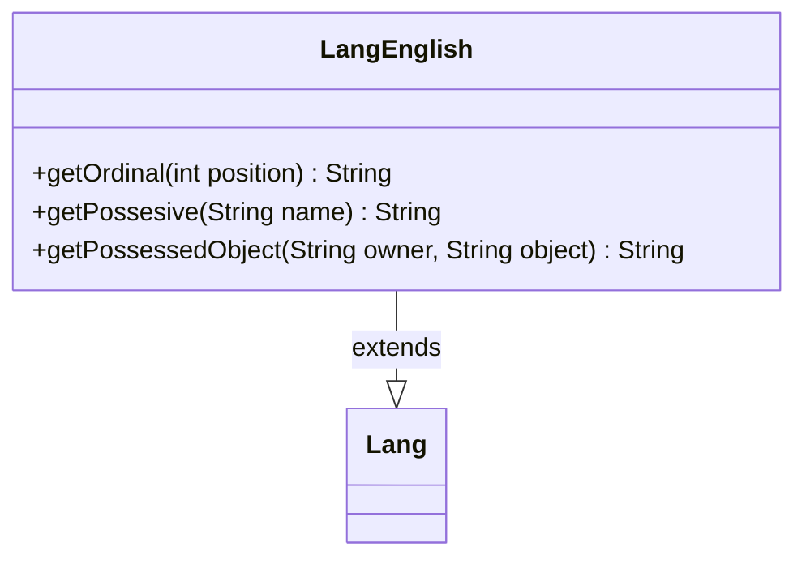

---
aliases:
  - LangEnglish
tags:
  - java/class
  - module/forge-core
  - pkg/forge/util/lang
fqn: forge.util.lang.LangEnglish
package: forge.util.lang
module: forge-core
kind: Class
---

# LangEnglish

**Package:** `forge.util.lang` &nbsp; **Module:** `forge-core` &nbsp; **Kind:** Class



## Relationships
**Extends:**
- [[forge.util.Lang|Lang]]

## Source
`forge-core/src/main/java/forge/util/lang/LangEnglish.java`

```java
package forge.util.lang;

import forge.util.Lang;

public class LangEnglish extends Lang {
    
    @Override
    public String getOrdinal(final int position) {
        final String[] sufixes = new String[] { "th", "st", "nd", "rd", "th", "th", "th", "th", "th", "th" };
        switch (position % 100) {
        case 11:
        case 12:
        case 13:
            return position + "th";
        default:
            return position + sufixes[position % 10];
        }
    }

    @Override
    public String getPossesive(final String name) {
        if ("You".equalsIgnoreCase(name)) {
            return name + "r"; // to get "your"
        }
        return name.endsWith("s") ? name + "'" : name + "'s";
    }

    @Override
    public String getPossessedObject(final String owner, final String object) {
        return getPossesive(owner) + " " + object;
    }

}
```
