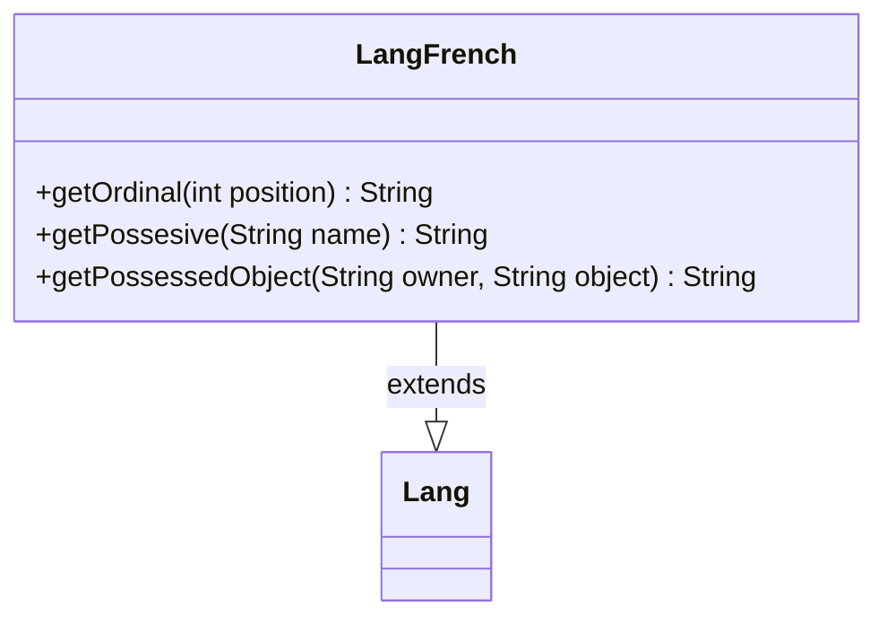

---
aliases:
  - LangFrench
tags:
  - java/class
  - module/forge-core
  - pkg/forge/util/lang
fqn: forge.util.lang.LangFrench
package: forge.util.lang
module: forge-core
kind: Class
---

# LangFrench

**Package:** `forge.util.lang` &nbsp; **Module:** `forge-core` &nbsp; **Kind:** Class



## Relationships
**Extends:**
- [[forge.util.Lang|Lang]]

## Source
`forge-core/src/main/java/forge/util/lang/LangFrench.java`

```java
package forge.util.lang;

import forge.util.Lang;

public class LangFrench extends Lang {

    @Override
    public String getOrdinal(final int position) {
        if (position == 1) {
            return position + "er";
        } else {
            return position + "e";
        }
    }

    @Override
    public String getPossesive(final String name) {
        if ("Vous".equalsIgnoreCase(name)) {
            return name;
        }
        return "de " + name;
    }

    @Override
    public String getPossessedObject(final String owner, final String object) {
        if ("Vous".equalsIgnoreCase(owner)) {
            return getPossesive(owner) + " " + object;
        }
        return object + " " + getPossesive(owner);
    }

}
```
