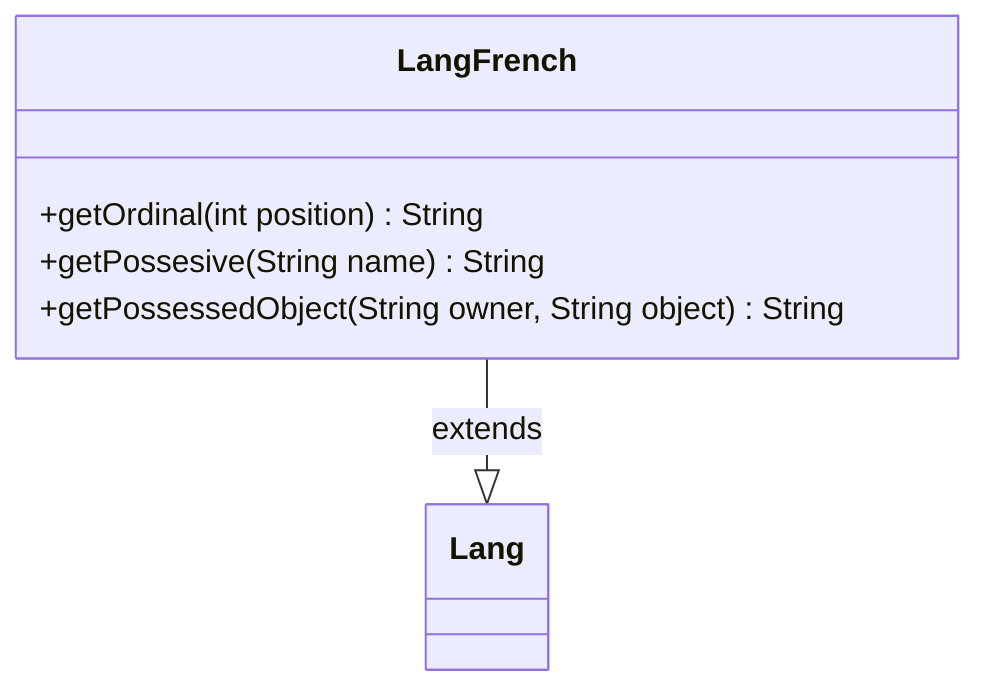

---
aliases:
  - LangFrench
tags:
  - java/class
  - module/forge-core
  - pkg/forge/util/lang
fqn: forge.util.lang.LangFrench
package: forge.util.lang
module: forge-core
kind: Class
---

# LangFrench

**Package:** `forge.util.lang`   **Module:** `forge-core`   **Kind:** Class



## Relationships
**Extends:**
- [[forge.util.Lang|Lang]]

## Design Description

French-language localization implementation of the abstract `Lang` base class, supplying French grammatical rules for rendering player-facing text in the Forge engine. It overrides three formatting hooks: `getOrdinal` produces French ordinals ("1er", "2e", …), while `getPossesive` and `getPossessedObject` construct French possessive phrases, special-casing the pronoun "Vous" and otherwise applying the "de"-prefix with the noun-following word order characteristic of French.

By extending `Lang`, the class plugs into a Strategy-style polymorphic dispatch where the engine selects a language subclass at runtime to localize grammatical constructs. Its sole responsibility is encoding French linguistic conventions, keeping locale-specific logic isolated from callers that depend only on the `Lang` interface.

## Source
`forge-core/src/main/java/forge/util/lang/LangFrench.java`

```java
package forge.util.lang;

import forge.util.Lang;

public class LangFrench extends Lang {

    @Override
    public String getOrdinal(final int position) {
        if (position == 1) {
            return position + "er";
        } else {
            return position + "e";
        }
    }

    @Override
    public String getPossesive(final String name) {
        if ("Vous".equalsIgnoreCase(name)) {
            return name;
        }
        return "de " + name;
    }

    @Override
    public String getPossessedObject(final String owner, final String object) {
        if ("Vous".equalsIgnoreCase(owner)) {
            return getPossesive(owner) + " " + object;
        }
        return object + " " + getPossesive(owner);
    }

}
```

## Python
`forge/util/lang/LangFrench.py`

```python
from forge.util.Lang import Lang


class LangFrench(Lang):

    def getOrdinal(self, position: int) -> str:
        if position == 1:
            return str(position) + "er"
        else:
            return str(position) + "e"

    def getPossesive(self, name: str) -> str:
        if "Vous".lower() == name.lower():
            return name
        return "de " + name

    def getPossessedObject(self, owner: str, object: str) -> str:
        if "Vous".lower() == owner.lower():
            return self.getPossesive(owner) + " " + object
        return object + " " + self.getPossesive(owner)
```
