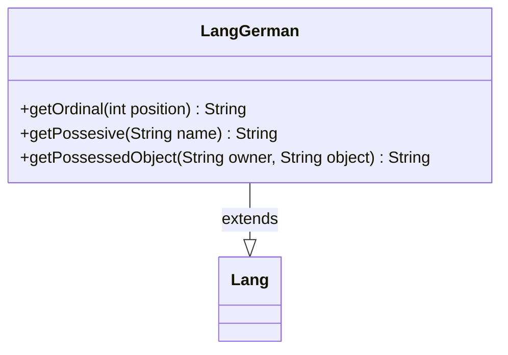

---
aliases:
  - LangGerman
tags:
  - java/class
  - module/forge-core
  - pkg/forge/util/lang
fqn: forge.util.lang.LangGerman
package: forge.util.lang
module: forge-core
kind: Class
---

# LangGerman

**Package:** `forge.util.lang` &nbsp; **Module:** `forge-core` &nbsp; **Kind:** Class



## Relationships
**Extends:**
- [[forge.util.Lang|Lang]]

## Design Description

Forge's German-locale implementation of language-specific text formatting, LangGerman extends the abstract `Lang` base class to render grammatically correct German strings for the game UI. It overrides three formatting hooks: `getOrdinal` builds German ordinals with the "-te"/"-ste" suffix convention (switching at position 20), while `getPossesive` and `getPossessedObject` construct possessive phrases, special-casing "You" to yield "your" and appending an apostrophe to names ending in "s".

As a concrete subclass in Forge's localization strategy, it collaborates with the `Lang` hierarchy to let callers obtain locale-appropriate output without knowing the active language; the parallel English, French, and other Lang subclasses are selected at runtime by locale. A code comment flagging the dependency on `lblYou` in `de-DE.properties` signals the coupling between this formatting logic and the external translation resource bundle.

## Source
`forge-core/src/main/java/forge/util/lang/LangGerman.java`

```java
package forge.util.lang;

import forge.util.Lang;

public class LangGerman extends Lang {
    
    @Override
    public String getOrdinal(final int position) {
        if (position < 20) {
            return position + "te";
        }
        return position + "ste";
    }

    // TODO: Please update this when you modified lblYou in de-DE.properties
    @Override
    public String getPossesive(final String name) {
        if ("You".equalsIgnoreCase(name)) {
            return name + "r"; // to get "your"
        }
        return name.endsWith("s") ? name + "'" : name + "'s";
    }

    @Override
    public String getPossessedObject(final String owner, final String object) {
        return getPossesive(owner) + " " + object;
    }

}
```

## Python
`forge/util/lang/LangGerman.py`

```python
from forge.util.Lang import Lang


class LangGerman(Lang):

    def getOrdinal(self, position: int) -> str:
        if position < 20:
            return str(position) + "te"
        return str(position) + "ste"

    # TODO: Please update this when you modified lblYou in de-DE.properties
    def getPossesive(self, name: str) -> str:
        if name.lower() == "you".lower():
            return name + "r"  # to get "your"
        return name + "'" if name.endswith("s") else name + "'s"

    def getPossessedObject(self, owner: str, object: str) -> str:
        return self.getPossesive(owner) + " " + object
```
