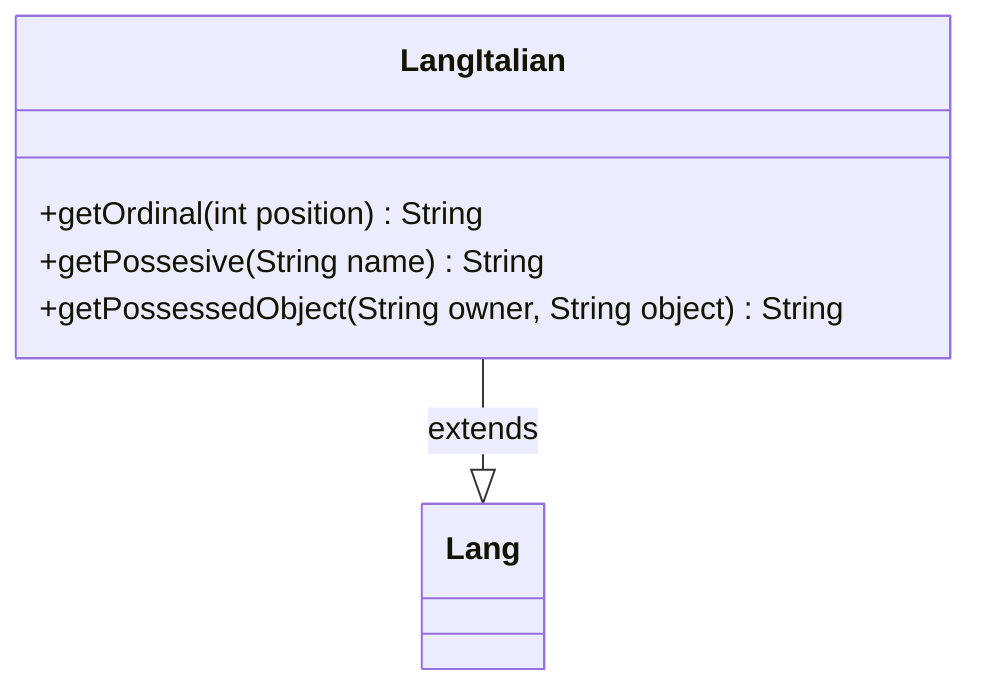

---
aliases:
  - LangItalian
tags:
  - java/class
  - module/forge-core
  - pkg/forge/util/lang
fqn: forge.util.lang.LangItalian
package: forge.util.lang
module: forge-core
kind: Class
---

# LangItalian

**Package:** `forge.util.lang`   **Module:** `forge-core`   **Kind:** Class



## Relationships
**Extends:**
- [[forge.util.Lang|Lang]]

## Design Description

LangItalian is a concrete localization strategy that adapts Forge's grammatical text generation to Italian. Extending the abstract `Lang` base class, it overrides three formatting hooks—`getOrdinal`, `getPossesive`, and `getPossessedObject`—so the engine can render ordinals, possessive forms, and possessed-object phrases according to Italian conventions while the rest of the codebase depends only on the `Lang` abstraction. It composes its own methods (`getPossessedObject` delegates to `getPossesive`) to keep possessive logic centralized. The implementation reveals pragmatic, incomplete localization intent: the possessive logic still falls back to English-style apostrophe-`s` rules and a hardcoded "You"→"Your" special case, flagged by a TODO tying it to the `it-IT.properties` resource bundle—signaling this class is a partial, evolving translation layer rather than a finished one.

## Source
`forge-core/src/main/java/forge/util/lang/LangItalian.java`

```java
package forge.util.lang;

import forge.util.Lang;

public class LangItalian extends Lang {
    
    @Override
    public String getOrdinal(final int position) {
        return position + "º";
    }

    // TODO: Please update this when you modified lblYou in it-IT.properties
    @Override
    public String getPossesive(final String name) {
        if ("You".equalsIgnoreCase(name)) {
            return name + "r"; // to get "your"
        }
        return name.endsWith("s") ? name + "'" : name + "'s";
    }

    @Override
    public String getPossessedObject(final String owner, final String object) {
        return getPossesive(owner) + " " + object;
    }

}
```

## Python
`forge/util/lang/LangItalian.py`

```python
from forge.util.Lang import Lang


class LangItalian(Lang):

    def getOrdinal(self, position: int) -> str:
        return str(position) + "????"

    # TODO: Please update this when you modified lblYou in it-IT.properties
    def getPossesive(self, name: str) -> str:
        if "You".lower() == name.lower():
            return name + "r"  # to get "your"
        return name + "'" if name.endswith("s") else name + "'s"

    def getPossessedObject(self, owner: str, object: str) -> str:
        return self.getPossesive(owner) + " " + object
```
