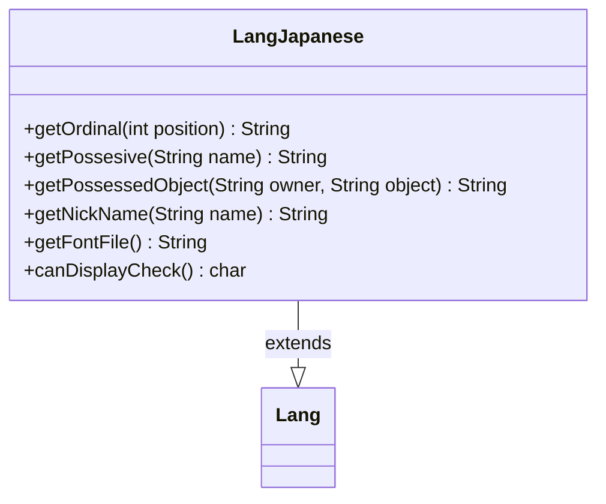

---
aliases:
  - LangJapanese
tags:
  - java/class
  - module/forge-core
  - pkg/forge/util/lang
fqn: forge.util.lang.LangJapanese
package: forge.util.lang
module: forge-core
kind: Class
---

# LangJapanese

**Package:** `forge.util.lang` &nbsp; **Module:** `forge-core` &nbsp; **Kind:** Class



## Relationships
**Extends:**
- [[forge.util.Lang|Lang]]

## Source
`forge-core/src/main/java/forge/util/lang/LangJapanese.java`

```java
package forge.util.lang;

import forge.util.Lang;

public class LangJapanese extends Lang {
    
    @Override
    public String getOrdinal(final int position) {
        return position + "番";
    }

    @Override
    public String getPossesive(final String name) {
        return name + "の";
    }

    @Override
    public String getPossessedObject(final String owner, final String object) {
        return getPossesive(owner) + object;
    }

    @Override
    public String getNickName(final String name) {
        String [] splitName = name.split("、");
        if (splitName.length > 1) return splitName[1];
        return name;
    }

    @Override
    public String getFontFile() {
        return "SourceHanSansJP";
    }
    public char canDisplayCheck() {
        return '鍮';
    }
}
```
