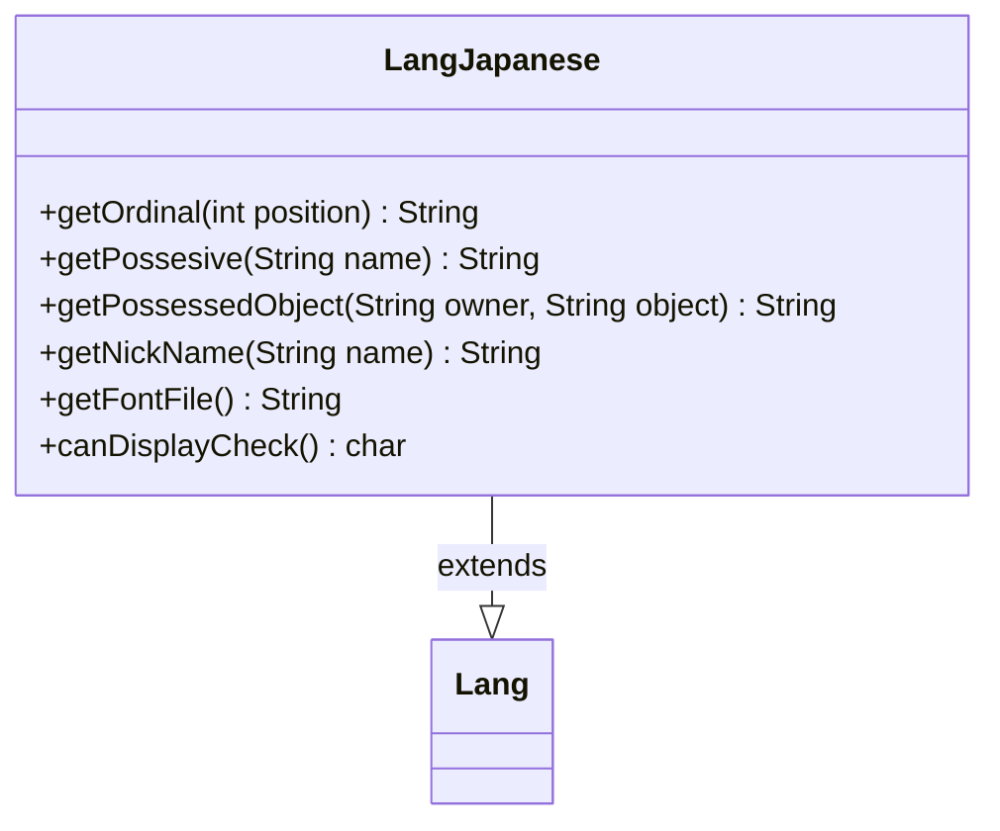

---
aliases:
  - LangJapanese
tags:
  - java/class
  - module/forge-core
  - pkg/forge/util/lang
fqn: forge.util.lang.LangJapanese
package: forge.util.lang
module: forge-core
kind: Class
---

# LangJapanese

**Package:** `forge.util.lang`   **Module:** `forge-core`   **Kind:** Class



## Relationships
**Extends:**
- [[forge.util.Lang|Lang]]

## Design Description

Japanese-specific implementation of the abstract `Lang` localization strategy, overriding its hooks to render text according to Japanese grammar and typography. It supplies a positional ordinal suffix (番), the possessive particle (の), and composes the two in `getPossessedObject`; `getNickName` extracts the second segment of a name split on the Japanese comma (、). Beyond grammar, it declares the font asset (`SourceHanSansJP`) needed to render CJK glyphs and a representative character used to verify the active font can display Japanese text.

As a concrete subtype of `Lang`, it plugs into Forge's locale dispatch so callers depend only on the `Lang` abstraction while language-specific behavior is selected at runtime. The design keeps all Japanese-specific string formatting and font-capability knowledge encapsulated behind the inherited interface, making each language a self-contained, swappable unit.

## Source
`forge-core/src/main/java/forge/util/lang/LangJapanese.java`

```java
package forge.util.lang;

import forge.util.Lang;

public class LangJapanese extends Lang {
    
    @Override
    public String getOrdinal(final int position) {
        return position + "番";
    }

    @Override
    public String getPossesive(final String name) {
        return name + "の";
    }

    @Override
    public String getPossessedObject(final String owner, final String object) {
        return getPossesive(owner) + object;
    }

    @Override
    public String getNickName(final String name) {
        String [] splitName = name.split("、");
        if (splitName.length > 1) return splitName[1];
        return name;
    }

    @Override
    public String getFontFile() {
        return "SourceHanSansJP";
    }
    public char canDisplayCheck() {
        return '鍮';
    }
}
```

## Python
`forge/util/lang/LangJapanese.py`

```python
from forge.util.Lang import Lang


class LangJapanese(Lang):

    def getOrdinal(self, position: int) -> str:
        return str(position) + "???????"

    def getPossesive(self, name: str) -> str:
        return name + "??????"

    def getPossessedObject(self, owner: str, object: str) -> str:
        return self.getPossesive(owner) + object

    def getNickName(self, name: str) -> str:
        splitName = name.split("???????")
        if len(splitName) > 1:
            return splitName[1]
        return name

    def getFontFile(self) -> str:
        return "SourceHanSansJP"

    def canDisplayCheck(self) -> str:
        return '??????'
```
