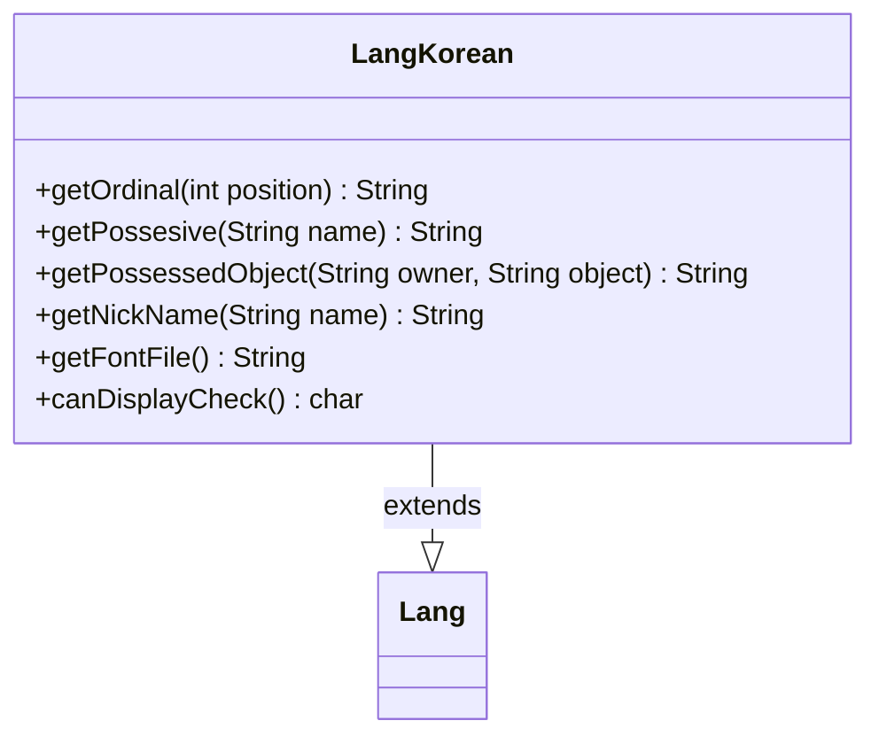

---
aliases:
  - LangKorean
tags:
  - java/class
  - module/forge-core
  - pkg/forge/util/lang
fqn: forge.util.lang.LangKorean
package: forge.util.lang
module: forge-core
kind: Class
---

# LangKorean

**Package:** `forge.util.lang`   **Module:** `forge-core`   **Kind:** Class



## Relationships
**Extends:**
- [[forge.util.Lang|Lang]]

## Design Description

LangKorean is a concrete localization strategy that adapts Forge's text-generation routines to Korean. Extending the abstract `Lang` base class, it overrides the formatting hooks—ordinal numbering, possessive construction, possessed-object phrasing, and nickname extraction—so that game messages read naturally in Korean rather than English. Possessive handling special-cases the second-person pronoun ("You"/"당신"), while nickname parsing splits on a comma to take the leading name token.

As one of several language-specific subclasses selected polymorphically by Forge's localization layer, it also declares its rendering needs: `getFontFile` points to the Source Han Sans KR font required to display Korean glyphs, and `canDisplayCheck` returns a representative character used to confirm font support. The design keeps locale logic isolated behind the `Lang` interface, letting the engine swap languages without altering call sites.

## Source
`forge-core/src/main/java/forge/util/lang/LangKorean.java`

```java
package forge.util.lang;

import forge.util.Lang;

public class LangKorean extends Lang {

    @Override
    public String getOrdinal(final int position) {
        return position + "번째";
    }

    @Override
    public String getPossesive(final String name) {
        if ("당신".equals(name) || "You".equalsIgnoreCase(name)) {
            return "당신의";
        }
        return name + "의";
    }

    @Override
    public String getPossessedObject(final String owner, final String object) {
        return getPossesive(owner) + " " + object;
    }

    @Override
    public String getNickName(final String name) {
        String [] splitName = name.split(",");
        if (splitName.length > 1) return splitName[0].trim();
        return name;
    }

    @Override
    public String getFontFile() {
        return "SourceHanSansKR";
    }
    public char canDisplayCheck() {
        return '째';
    }
}
```

## Python
`forge/util/lang/LangKorean.py`

```python
from forge.util.Lang import Lang


class LangKorean(Lang):

    def getOrdinal(self, position: int) -> str:
        return str(position) + "????????????"

    def getPossesive(self, name: str) -> str:
        if "??????????????" == name or "You".lower() == name.lower():
            return "????????????????????"
        return name + "??????"

    def getPossessedObject(self, owner: str, object: str) -> str:
        return self.getPossesive(owner) + " " + object

    def getNickName(self, name: str) -> str:
        splitName = name.split(",")
        if len(splitName) > 1:
            return splitName[0].strip()
        return name

    def getFontFile(self) -> str:
        return "SourceHanSansKR"

    def canDisplayCheck(self) -> str:
        return '??????'
```
