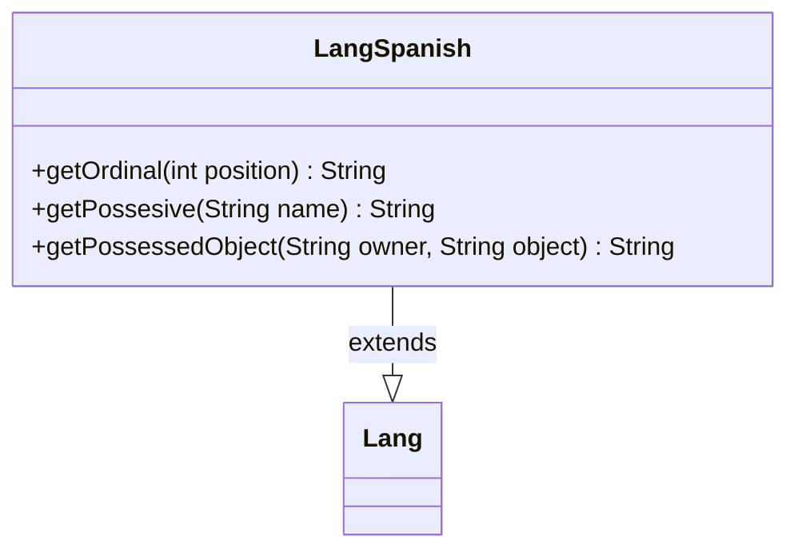

---
aliases:
  - LangSpanish
tags:
  - java/class
  - module/forge-core
  - pkg/forge/util/lang
fqn: forge.util.lang.LangSpanish
package: forge.util.lang
module: forge-core
kind: Class
---

# LangSpanish

**Package:** `forge.util.lang`   **Module:** `forge-core`   **Kind:** Class



## Relationships
**Extends:**
- [[forge.util.Lang|Lang]]

## Design Description

LangSpanish is a concrete localization strategy that adapts Forge's language-dependent text formatting to Spanish. As a subclass of the abstract `Lang` base, it overrides the engine's hooks for grammatical formatting—ordinals, possessives, and possessed-object phrasing—so that game messages read naturally in Spanish. It collaborates with `Lang` through the template-method pattern: callers depend on the `Lang` interface while LangSpanish supplies locale-specific behavior. The design intent is visible in its handling of Spanish word order, where possession is rendered as "de <name>" and the possessed object normally follows its owner, with a special case for the second-person "Tu" that suppresses the preposition and reorders the phrase to match natural Spanish grammar.

## Source
`forge-core/src/main/java/forge/util/lang/LangSpanish.java`

```java
package forge.util.lang;

import forge.util.Lang;

public class LangSpanish extends Lang {
    
    @Override
    public String getOrdinal(final int position) {
        return position + "º";
    }

    @Override
    public String getPossesive(final String name) {
        if ("Tu".equalsIgnoreCase(name)) {
            return name;
        }
        return "de " + name;
    }

    @Override
    public String getPossessedObject(final String owner, final String object) {
        if ("Tu".equalsIgnoreCase(owner)) {
            return getPossesive(owner) + " " + object;
        }
        return object + " " + getPossesive(owner);
    }

}
```

## Python
`forge/util/lang/LangSpanish.py`

```python
from forge.util.Lang import Lang


class LangSpanish(Lang):

    def getOrdinal(self, position: int) -> str:
        return str(position) + "????"

    def getPossesive(self, name: str) -> str:
        if "Tu".lower() == name.lower():
            return name
        return "de " + name

    def getPossessedObject(self, owner: str, object: str) -> str:
        if "Tu".lower() == owner.lower():
            return self.getPossesive(owner) + " " + object
        return object + " " + self.getPossesive(owner)
```
