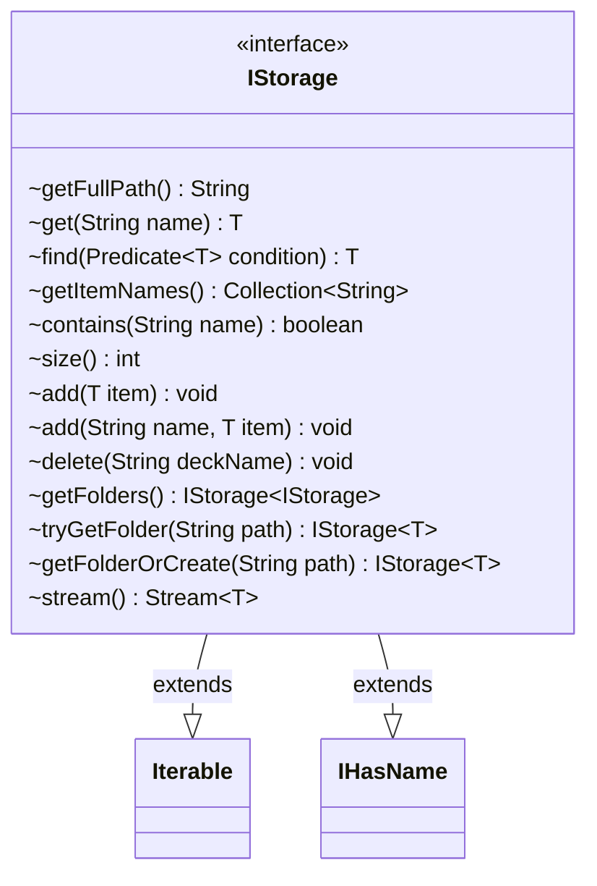

---
aliases:
  - IStorage
tags:
  - java/interface
  - module/forge-core
  - pkg/forge/util/storage
fqn: forge.util.storage.IStorage
package: forge.util.storage
module: forge-core
kind: Interface
---

# IStorage

**Package:** `forge.util.storage` &nbsp; **Module:** `forge-core` &nbsp; **Kind:** Interface



## Relationships
**Extends:**
- [[forge.util.IHasName|IHasName]]

## Source
`forge-core/src/main/java/forge/util/storage/IStorage.java`

```java
/*
 * Forge: Play Magic: the Gathering.
 * Copyright (C) 2011  Forge Team
 *
 * This program is free software: you can redistribute it and/or modify
 * it under the terms of the GNU General Public License as published by
 * the Free Software Foundation, either version 3 of the License, or
 * (at your option) any later version.
 *
 * This program is distributed in the hope that it will be useful,
 * but WITHOUT ANY WARRANTY; without even the implied warranty of
 * MERCHANTABILITY or FITNESS FOR A PARTICULAR PURPOSE.  See the
 * GNU General Public License for more details.
 *
 * You should have received a copy of the GNU General Public License
 * along with this program.  If not, see <http://www.gnu.org/licenses/>.
 */
package forge.util.storage;

import forge.util.IHasName;

import java.util.Collection;
import java.util.function.Predicate;
import java.util.stream.Stream;

public interface IStorage<T> extends Iterable<T>, IHasName {
    String getFullPath();
    T get(String name);
    T find(Predicate<T> condition);
    Collection<String> getItemNames();
    boolean contains(String name);
    int size();
    void add(T item);
    void add(String name, T item);
    void delete(String deckName);
    IStorage<IStorage<T>> getFolders();
    IStorage<T> tryGetFolder(String path);
    IStorage<T> getFolderOrCreate(String path);
    Stream<T> stream();
}
```
