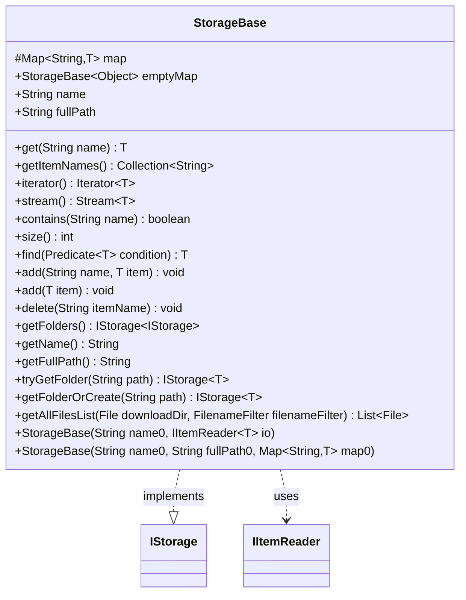

---
aliases:
  - StorageBase
tags:
  - java/class
  - module/forge-core
  - pkg/forge/util/storage
fqn: forge.util.storage.StorageBase
package: forge.util.storage
module: forge-core
kind: Class
---

# StorageBase

**Package:** `forge.util.storage` &nbsp; **Module:** `forge-core` &nbsp; **Kind:** Class



## Relationships
**Implements:**
- [[forge.util.storage.IStorage|IStorage]]
**Uses:**
- [[forge.util.IItemReader|IItemReader]]

## Source
`forge-core/src/main/java/forge/util/storage/StorageBase.java`

```java
/*
 * Forge: Play Magic: the Gathering.
 * Copyright (C) 2011  Forge Team
 *
 * This program is free software: you can redistribute it and/or modify
 * it under the terms of the GNU General Public License as published by
 * the Free Software Foundation, either version 3 of the License, or
 * (at your option) any later version.
 * 
 * This program is distributed in the hope that it will be useful,
 * but WITHOUT ANY WARRANTY; without even the implied warranty of
 * MERCHANTABILITY or FITNESS FOR A PARTICULAR PURPOSE.  See the
 * GNU General Public License for more details.
 * 
 * You should have received a copy of the GNU General Public License
 * along with this program.  If not, see <http://www.gnu.org/licenses/>.
 */
package forge.util.storage;

import forge.util.IItemReader;
import forge.util.IterableUtil;

import java.io.File;
import java.io.FilenameFilter;
import java.util.*;
import java.util.function.Predicate;
import java.util.stream.Stream;

/**
 * <p>
 * StorageBase class.
 * </p>
 *
 * @param <T> the generic type
 * @author Forge
 * @version $Id: StorageBase.java 13590 2012-01-27 20:46:27Z Max mtg $
 */
public class StorageBase<T> implements IStorage<T> {
    protected final Map<String, T> map;

    public final static StorageBase<?> emptyMap = new StorageBase<>("Empty", null, new HashMap<>());
    public final String name, fullPath;

    public StorageBase(final String name0, final IItemReader<T> io) {
        this(name0, io.getFullPath(), io.readAll());
    }

    public StorageBase(final String name0, final String fullPath0, final Map<String, T> map0) {
        name = name0;
        fullPath = fullPath0;
        map = map0;
    }

    @Override
    public T get(final String name) {
        return map.get(name);
    }

    @Override
    public final Collection<String> getItemNames() {
        return new ArrayList<>(map.keySet());
    }

    @Override
    public Iterator<T> iterator() {
        return map.values().iterator();
    }

    @Override
    public Stream<T> stream() {
        return map.values().stream();
    }

    @Override
    public boolean contains(String name) {
        return name != null && map.containsKey(name);
    }

    @Override
    public int size() {
        return map.size();
    }

    @Override
    public T find(Predicate<T> condition) {
        return IterableUtil.tryFind(map.values(), condition).orElse(null);
    }

    @Override
    public void add(String name, T item) {
        throw new UnsupportedOperationException("This is a read-only storage");
    }

    @Override
    public void add(T item) {
        throw new UnsupportedOperationException("This is a read-only storage");
    }

    @Override
    public void delete(String itemName) {
        throw new UnsupportedOperationException("This is a read-only storage");
    }

    // we don't have nested folders unless that's overridden in a derived class
    @SuppressWarnings("unchecked")
    @Override
    public IStorage<IStorage<T>> getFolders() {
        return (IStorage<IStorage<T>>) emptyMap;
    }

    @Override
    public final String getName() {
        return name;
    }

    @Override
    public final String getFullPath() {
        if (fullPath == null) {
            return name;
        }
        return fullPath;
    }

    @Override
    public IStorage<T> tryGetFolder(String path) {
        throw new UnsupportedOperationException("This storage does not support subfolders");
    }

    @Override
    public IStorage<T> getFolderOrCreate(String path) {
        throw new UnsupportedOperationException("This storage does not support subfolders");
    }

    /**
     * Return all the files in a given path tree (traversed recursively) that would match
     * the input <code>FilenameFilter</code>.
     *
     * @param downloadDir  Target root path to traverse
     * @param filenameFilter  <code>FilenameFilter</code> used to select files of interest
     * @return The <code>List</code> of all <code>File</code> objects found in the root path
     * that passed the provided <code>FilenameFilter</code>.
     * An empty list will be returned if the target path is empty, or no file matching the filter
     * will be (recursively) found.
     */
    public static List<File> getAllFilesList(File downloadDir, FilenameFilter filenameFilter){
        File[] filesList = downloadDir.listFiles(filenameFilter);
        ArrayList<File> allFilesList = new ArrayList<>();
        if (filesList != null)
            allFilesList.addAll(Arrays.asList(filesList));
        File[] subFolders = downloadDir.listFiles(File::isDirectory);
        if(subFolders != null) {
            for (File subFolder : subFolders)
                allFilesList.addAll(getAllFilesList(subFolder, filenameFilter));
        }
        return allFilesList;
    }
}
```
