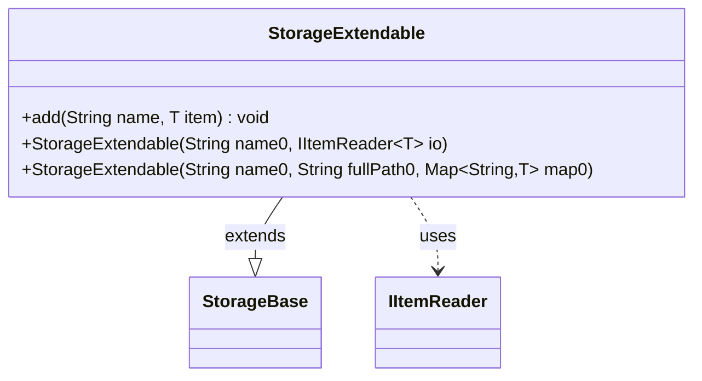

---
aliases:
  - StorageExtendable
tags:
  - java/class
  - module/forge-core
  - pkg/forge/util/storage
fqn: forge.util.storage.StorageExtendable
package: forge.util.storage
module: forge-core
kind: Class
---

# StorageExtendable

**Package:** `forge.util.storage`   **Module:** `forge-core`   **Kind:** Class



## Relationships
**Extends:**
- [[forge.util.storage.StorageBase|StorageBase]]
**Uses:**
- [[forge.util.IItemReader|IItemReader]]

## Design Description

StorageExtendable is a concrete, generic storage implementation that specializes its parent `StorageBase<T>` to permit mutation. Inheriting both the reader-backed and pre-populated-map constructors, it simply delegates each to `super`, while overriding `add` to insert named items directly into the inherited backing map. This override is the class's whole reason for existing: it turns the otherwise read-oriented base storage into an extendable collection that callers can grow at runtime. It collaborates with `IItemReader<T>` only indirectly, passing it through to the superclass to source initial contents, and keeps its own footprint deliberately minimal—adding write capability without duplicating the lookup, naming, or path-handling logic already provided by `StorageBase`.

## Source
`forge-core/src/main/java/forge/util/storage/StorageExtendable.java`

```java
/*
 * Forge: Play Magic: the Gathering.
 * Copyright (C) 2011  Forge Team
 *
 * This program is free software: you can redistribute it and/or modify
 * it under the terms of the GNU General Public License as published by
 * the Free Software Foundation, either version 3 of the License, or
 * (at your option) any later version.
 *
 * This program is distributed in the hope that it will be useful,
 * but WITHOUT ANY WARRANTY; without even the implied warranty of
 * MERCHANTABILITY or FITNESS FOR A PARTICULAR PURPOSE.  See the
 * GNU General Public License for more details.
 *
 * You should have received a copy of the GNU General Public License
 * along with this program.  If not, see <http://www.gnu.org/licenses/>.
 */
package forge.util.storage;

import forge.util.IItemReader;

import java.util.Map;

/**
 * <p>
 * StorageBase class.
 * </p>
 *
 * @param <T> the generic type
 * @author Forge
 * @version $Id: StorageBase.java 13590 2012-01-27 20:46:27Z Max mtg $
 */
public class StorageExtendable<T> extends StorageBase<T> {

    public StorageExtendable(String name0, IItemReader<T> io) {
        super(name0, io);
    }

    public StorageExtendable(final String name0, final String fullPath0, final Map<String, T> map0) {
        super(name0, fullPath0, map0);
    }

    @Override
    public void add(String name, T item) {
        map.put(name, item);
    }
}
```

## Python
`forge/util/storage/StorageExtendable.py`

```python
from forge.util.storage.StorageBase import StorageBase
from forge.util.IItemReader import IItemReader

import typing

T = typing.TypeVar("T")


class StorageExtendable(StorageBase[T]):

    @typing.overload
    def __init__(self, name0: str, io: IItemReader[T]): ...

    @typing.overload
    def __init__(self, name0: str, fullPath0: str, map0: dict[str, T]): ...

    def __init__(self, name0, *args):
        if len(args) == 1:
            io = args[0]
            super().__init__(name0, io)
        else:
            fullPath0, map0 = args
            super().__init__(name0, fullPath0, map0)

    def add(self, name: str, item: T) -> None:
        self.map[name] = item
```
