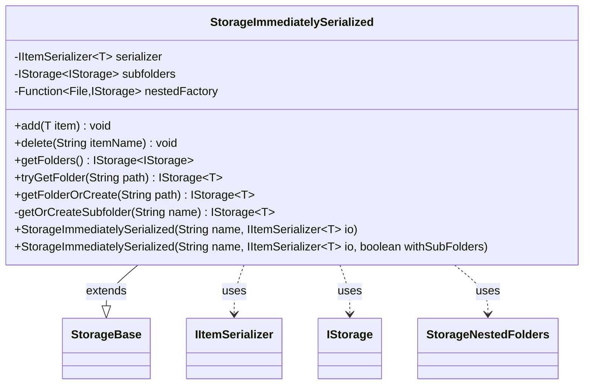

---
aliases:
  - StorageImmediatelySerialized
tags:
  - java/class
  - module/forge-core
  - pkg/forge/util/storage
fqn: forge.util.storage.StorageImmediatelySerialized
package: forge.util.storage
module: forge-core
kind: Class
---

# StorageImmediatelySerialized

**Package:** `forge.util.storage` &nbsp; **Module:** `forge-core` &nbsp; **Kind:** Class



## Relationships
**Extends:**
- [[forge.util.storage.StorageBase|StorageBase]]
**Uses:**
- [[forge.util.IItemSerializer|IItemSerializer]]
- [[forge.util.storage.IStorage|IStorage]]
- [[forge.util.storage.StorageNestedFolders|StorageNestedFolders]]

## Design Description

StorageImmediatelySerialized is a generic `IStorage<T>` implementation, extending `StorageBase<T>`, that persists each item to disk the moment it is mutated rather than batching a deferred save. Its `add` and `delete` operations update the in-memory map inherited from the base class and immediately delegate to an injected `IItemSerializer<T>`, which owns the actual read/write/erase logic and resolves the backing directory and subfolder list.

The class optionally models a hierarchical, folder-based store: when constructed with `withSubFolders`, it builds a `StorageNestedFolders` view of child storages via a `nestedFactory` that recursively wraps each subdirectory in another StorageImmediatelySerialized. Path-based navigation (`tryGetFolder`, `getFolderOrCreate`) splits paths on `/` and recurses one segment at a time, lazily creating subfolders on demand. This design separates persistence concerns (the serializer) from storage structure and traversal, letting the same type serve both flat collections and nested folder trees.

## Source
`forge-core/src/main/java/forge/util/storage/StorageImmediatelySerialized.java`

```java
/*
 * Forge: Play Magic: the Gathering.
 * Copyright (C) 2011  Forge Team
 *
 * This program is free software: you can redistribute it and/or modify
 * it under the terms of the GNU General Public License as published by
 * the Free Software Foundation, either version 3 of the License, or
 * (at your option) any later version.
 * 
 * This program is distributed in the hope that it will be useful,
 * but WITHOUT ANY WARRANTY; without even the implied warranty of
 * MERCHANTABILITY or FITNESS FOR A PARTICULAR PURPOSE.  See the
 * GNU General Public License for more details.
 * 
 * You should have received a copy of the GNU General Public License
 * along with this program.  If not, see <http://www.gnu.org/licenses/>.
 */
package forge.util.storage;

import forge.util.IItemSerializer;
import forge.util.TextUtil;

import java.io.File;
import java.util.function.Function;

/**
 * <p>
 * StorageImmediatelySerialized class.
 * </p>
 *
 * @param <T> the generic type
 * @author Forge
 * @version $Id: StorageImmediatelySerialized.java 24272 2014-01-15 05:07:59Z drdev $
 */
public class StorageImmediatelySerialized<T> extends StorageBase<T> {
    private final IItemSerializer<T> serializer;
    private final IStorage<IStorage<T>> subfolders;

    private final Function<File, IStorage<T>> nestedFactory = new Function<File, IStorage<T>>() {
        @Override
        public IStorage<T> apply(File file) {
            return new StorageImmediatelySerialized<>(file.getName(), (IItemSerializer<T>) serializer.getReaderForFolder(file), true);
        }
    };

    /**
     * <p>
     * Constructor for StorageImmediatelySerialized.
     * </p>
     *
     * @param io the io
     */
    public StorageImmediatelySerialized(String name, final IItemSerializer<T> io) {
        this(name, io, false);
    }

    public StorageImmediatelySerialized(String name, final IItemSerializer<T> io, boolean withSubFolders) {
        super(name, io);
        this.serializer = io;
        subfolders = withSubFolders ? new StorageNestedFolders<>(io.getDirectory(), io.getSubFolders(), nestedFactory) : null;
    }

    /*
     * (non-Javadoc)
     * 
     * @see forge.util.storage.StorageBase#add(T)
     */
    @Override
    public final void add(final T item) {
        String name = serializer.getItemKey(item);
        this.map.put(name, item);
        this.serializer.save(item);
    }

    /*
     * (non-Javadoc)
     * 
     * @see forge.util.storage.StorageBase#delete(java.lang.String)
     */
    @Override
    public final void delete(final String itemName) {
        try {
            this.serializer.erase(this.map.remove(itemName));
        }
        catch (Exception e) {
            e.printStackTrace();
        }
    }

    /* (non-Javadoc)
     * @see forge.util.storage.StorageBase#getFolders()
     */
    @Override
    public IStorage<IStorage<T>> getFolders() {
        return subfolders == null ? super.getFolders() : subfolders;
    }
    
    @Override
    public IStorage<T> tryGetFolder(String path) {
        String[] parts = TextUtil.split(path, '/', 2);
        switch( parts.length ) {
            case 0: return this;
            case 1: return parts[0].equals(".") ? this : getFolders().get(parts[0]);
            case 2:
                IStorage<T> subFolder = getFolders().get(parts[0]);
                return subFolder == null ? null : subFolder.tryGetFolder(parts[1]);
        }
     // should not reach this unless split is broken
        throw new IllegalArgumentException(path); 
    }

    @Override
    public IStorage<T> getFolderOrCreate(String path) {
        String[] parts = TextUtil.split(path, '/', 2);
        switch( parts.length ) {
            case 0: return this;
            case 1: return parts[0].equals(".") ? this : getOrCreateSubfolder(parts[0]);
            case 2: return getOrCreateSubfolder(parts[0]).getFolderOrCreate(parts[1]);
        }
     // should not reach this unless split is broken
        throw new IllegalArgumentException(path); 
    }
    
    private IStorage<T> getOrCreateSubfolder(String name) {
        // Have to filter name for incorrect symbols 
        IStorage<T> storage = getFolders().get(name);
        if( null == storage ) {
            storage = new StorageImmediatelySerialized<>(name, serializer);
            subfolders.add(storage);
        }
        return storage;
    }
}
```

## Python
`forge/util/storage/StorageImmediatelySerialized.py`

```python
from forge.util.IItemSerializer import IItemSerializer
from forge.util.TextUtil import TextUtil
from forge.util.storage.StorageBase import StorageBase
from forge.util.storage.IStorage import IStorage
from forge.util.storage.StorageNestedFolders import StorageNestedFolders

import os


class StorageImmediatelySerialized(StorageBase):
    def __init__(self, name, io, withSubFolders=False):
        super().__init__(name, io)
        self.serializer = io
        self.nestedFactory = lambda file: StorageImmediatelySerialized(
            os.path.basename(file), self.serializer.getReaderForFolder(file), True)
        self.subfolders = StorageNestedFolders(
            io.getDirectory(), io.getSubFolders(), self.nestedFactory) if withSubFolders else None

    def add(self, item):
        name = self.serializer.getItemKey(item)
        self.map[name] = item
        self.serializer.save(item)

    def delete(self, itemName):
        try:
            self.serializer.erase(self.map.pop(itemName, None))
        except Exception as e:
            import traceback
            traceback.print_exc()

    def getFolders(self):
        return super().getFolders() if self.subfolders is None else self.subfolders

    def tryGetFolder(self, path):
        parts = TextUtil.split(path, '/', 2)
        if len(parts) == 0:
            return self
        elif len(parts) == 1:
            return self if parts[0] == "." else self.getFolders().get(parts[0])
        elif len(parts) == 2:
            subFolder = self.getFolders().get(parts[0])
            return None if subFolder is None else subFolder.tryGetFolder(parts[1])
        # should not reach this unless split is broken
        raise ValueError(path)

    def getFolderOrCreate(self, path):
        parts = TextUtil.split(path, '/', 2)
        if len(parts) == 0:
            return self
        elif len(parts) == 1:
            return self if parts[0] == "." else self.getOrCreateSubfolder(parts[0])
        elif len(parts) == 2:
            return self.getOrCreateSubfolder(parts[0]).getFolderOrCreate(parts[1])
        # should not reach this unless split is broken
        raise ValueError(path)

    def getOrCreateSubfolder(self, name):
        # Have to filter name for incorrect symbols
        storage = self.getFolders().get(name)
        if storage is None:
            storage = StorageImmediatelySerialized(name, self.serializer)
            self.subfolders.add(storage)
        return storage
```
