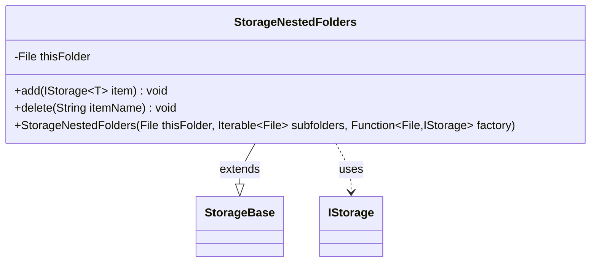

---
aliases:
  - StorageNestedFolders
tags:
  - java/class
  - module/forge-core
  - pkg/forge/util/storage
fqn: forge.util.storage.StorageNestedFolders
package: forge.util.storage
module: forge-core
kind: Class
---

# StorageNestedFolders

**Package:** `forge.util.storage`   **Module:** `forge-core`   **Kind:** Class



## Relationships
**Extends:**
- [[forge.util.storage.StorageBase|StorageBase]]
**Uses:**
- [[forge.util.storage.IStorage|IStorage]]

## Design Description

StorageNestedFolders is a generic container that represents a tree node holding child storage units rather than leaf items, exposing each subfolder on disk as a nested `IStorage<T>`. By extending `StorageBase<IStorage<T>>`, it reuses the base map-backed retrieval and iteration machinery, populating that map at construction time by applying the supplied `Function<File, IStorage<T>>` factory to each subfolder—a design that delegates the concrete storage type to the caller and keeps this class focused purely on the folder-grouping structure.

Its mutating operations are deliberately incomplete: `add` creates the subdirectory but throws `UnsupportedOperationException` pending recursive persistence, and `delete` removes the map entry but only attempts a shallow, non-recursive directory deletion. These stubs and TODO comments signal that the type currently serves read-oriented hierarchical access, with on-disk write-through left as future work.

## Source
`forge-core/src/main/java/forge/util/storage/StorageNestedFolders.java`

```java
package forge.util.storage;

import java.io.File;
import java.util.HashMap;
import java.util.function.Function;

public class StorageNestedFolders<T> extends StorageBase<IStorage<T>> {
    private final File thisFolder;

    public StorageNestedFolders(File thisFolder, Iterable<File> subfolders, Function<File, IStorage<T>> factory) {
        super("<Subfolders>", thisFolder.getPath(), new HashMap<>());
        this.thisFolder = thisFolder;
        for (File sf : subfolders) {
            IStorage<T> newUnit = factory.apply(sf);
            map.put(sf.getName(), newUnit);
        }
    }

    // need code implementations for folder create/delete operations

    @Override
    public void add(IStorage<T> item) {
        File subdir = new File(thisFolder, item.getName());
        subdir.mkdir();

        // TODO: save recursively the passed IStorage
        throw new UnsupportedOperationException("method is not implemented");
    }

    @Override
    public void delete(String itemName) {
        File subdir = new File(thisFolder, itemName);
        IStorage<T> f = map.remove(itemName);

        // TODO: Clear all that files from disk
        if (f != null) {
            subdir.delete(); // won't work if not empty;
        }
    }
}
```

## Python
`forge/util/storage/StorageNestedFolders.py`

```python
from forge.util.storage.StorageBase import StorageBase
from forge.util.storage.IStorage import IStorage

import os
from typing import Callable, Iterable, TypeVar, Generic

T = TypeVar("T")


class StorageNestedFolders(StorageBase[IStorage[T]], Generic[T]):
    def __init__(self, thisFolder: str, subfolders: Iterable[str], factory: Callable[[str], IStorage[T]]):
        super().__init__("<Subfolders>", thisFolder, {})
        self.thisFolder = thisFolder
        for sf in subfolders:
            newUnit = factory(sf)
            self.map[os.path.basename(sf)] = newUnit

    # need code implementations for folder create/delete operations

    def add(self, item: IStorage[T]) -> None:
        subdir = os.path.join(self.thisFolder, item.getName())
        os.mkdir(subdir)

        # TODO: save recursively the passed IStorage
        raise NotImplementedError("method is not implemented")

    def delete(self, itemName: str) -> None:
        subdir = os.path.join(self.thisFolder, itemName)
        f = self.map.pop(itemName, None)

        # TODO: Clear all that files from disk
        if f is not None:
            try:
                os.rmdir(subdir)  # won't work if not empty;
            except OSError:
                pass
```
