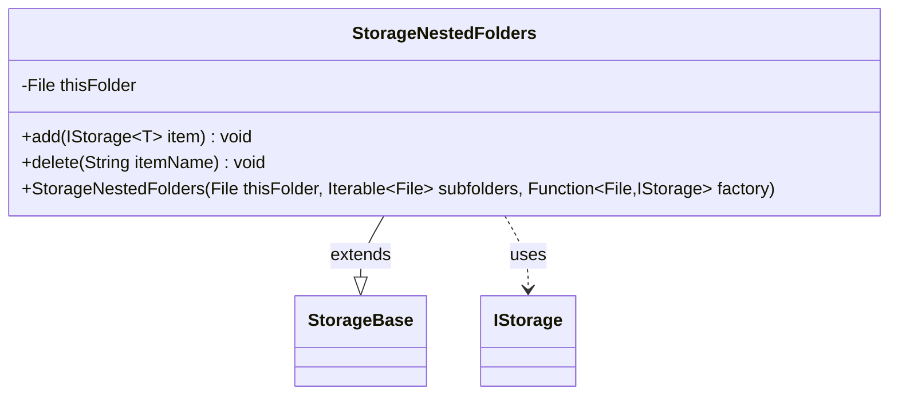

---
aliases:
  - StorageNestedFolders
tags:
  - java/class
  - module/forge-core
  - pkg/forge/util/storage
fqn: forge.util.storage.StorageNestedFolders
package: forge.util.storage
module: forge-core
kind: Class
---

# StorageNestedFolders

**Package:** `forge.util.storage` &nbsp; **Module:** `forge-core` &nbsp; **Kind:** Class



## Relationships
**Extends:**
- [[forge.util.storage.StorageBase|StorageBase]]
**Uses:**
- [[forge.util.storage.IStorage|IStorage]]

## Source
`forge-core/src/main/java/forge/util/storage/StorageNestedFolders.java`

```java
package forge.util.storage;

import java.io.File;
import java.util.HashMap;
import java.util.function.Function;

public class StorageNestedFolders<T> extends StorageBase<IStorage<T>> {
    private final File thisFolder;

    public StorageNestedFolders(File thisFolder, Iterable<File> subfolders, Function<File, IStorage<T>> factory) {
        super("<Subfolders>", thisFolder.getPath(), new HashMap<>());
        this.thisFolder = thisFolder;
        for (File sf : subfolders) {
            IStorage<T> newUnit = factory.apply(sf);
            map.put(sf.getName(), newUnit);
        }
    }

    // need code implementations for folder create/delete operations

    @Override
    public void add(IStorage<T> item) {
        File subdir = new File(thisFolder, item.getName());
        subdir.mkdir();

        // TODO: save recursively the passed IStorage
        throw new UnsupportedOperationException("method is not implemented");
    }

    @Override
    public void delete(String itemName) {
        File subdir = new File(thisFolder, itemName);
        IStorage<T> f = map.remove(itemName);

        // TODO: Clear all that files from disk
        if (f != null) {
            subdir.delete(); // won't work if not empty;
        }
    }
}
```
