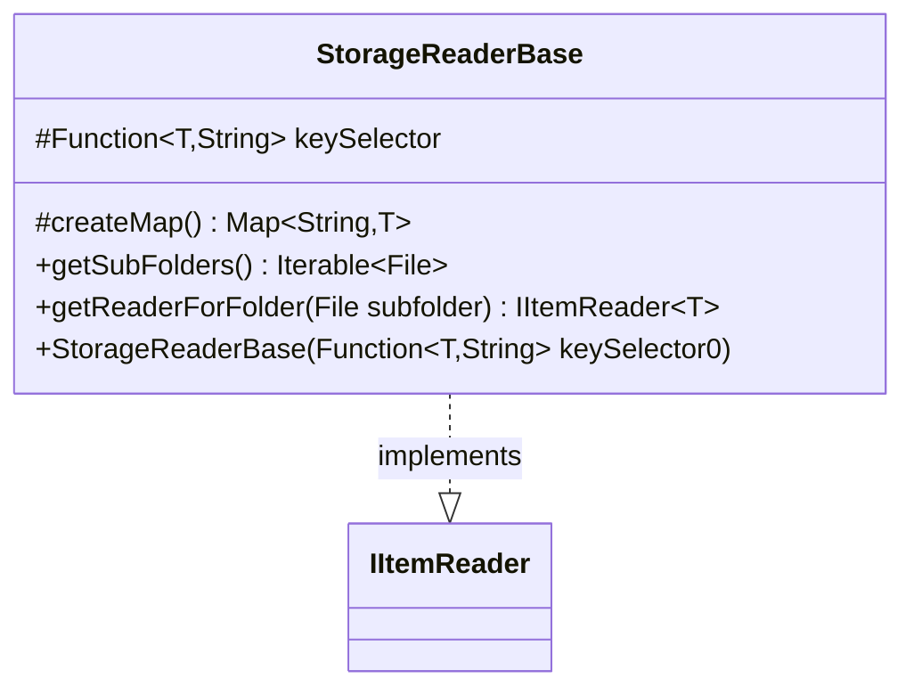

---
aliases:
  - StorageReaderBase
tags:
  - java/class
  - module/forge-core
  - pkg/forge/util/storage
fqn: forge.util.storage.StorageReaderBase
package: forge.util.storage
module: forge-core
kind: Class
---

# StorageReaderBase

**Package:** `forge.util.storage` &nbsp; **Module:** `forge-core` &nbsp; **Kind:** Class



## Relationships
**Implements:**
- [[forge.util.IItemReader|IItemReader]]

## Source
`forge-core/src/main/java/forge/util/storage/StorageReaderBase.java`

```java
package forge.util.storage;

import com.google.common.collect.ImmutableList;
import forge.util.IItemReader;

import java.io.File;
import java.util.Map;
import java.util.TreeMap;
import java.util.function.Function;

public abstract class StorageReaderBase<T> implements IItemReader<T> {
    protected final Function<? super T, String> keySelector;
    public StorageReaderBase(final Function<? super T, String> keySelector0) {
        keySelector = keySelector0;
    }

    protected Map<String, T> createMap() {
        return new TreeMap<>();
    }

    @Override
    public Iterable<File> getSubFolders() {
        // TODO Auto-generated method stub
        return ImmutableList.of();
    }

    @Override
    public IItemReader<T> getReaderForFolder(File subfolder) {
        throw new UnsupportedOperationException("This reader is not supposed to have nested folders");
    }
}
```
