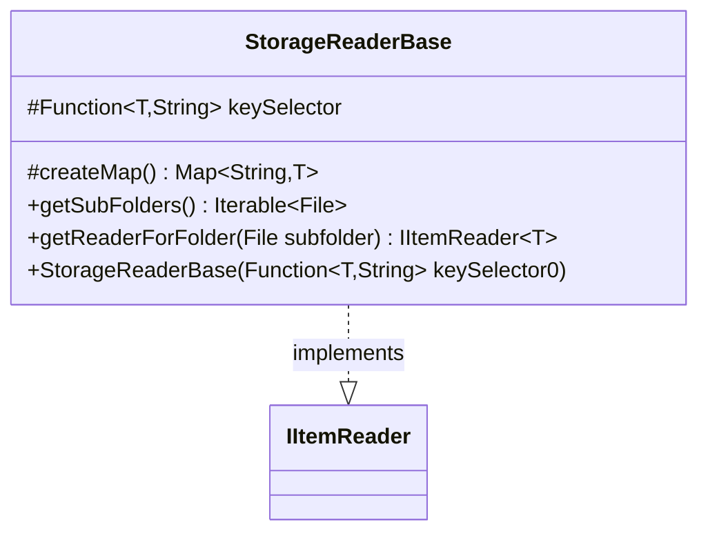

---
aliases:
  - StorageReaderBase
tags:
  - java/class
  - module/forge-core
  - pkg/forge/util/storage
fqn: forge.util.storage.StorageReaderBase
package: forge.util.storage
module: forge-core
kind: Class
---

# StorageReaderBase

**Package:** `forge.util.storage` &nbsp; **Module:** `forge-core` &nbsp; **Kind:** Class



## Relationships
**Implements:**
- [[forge.util.IItemReader|IItemReader]]

## Design Description

StorageReaderBase is an abstract base implementation of the `IItemReader<T>` interface, providing common scaffolding for reading typed items from storage while leaving the actual item-loading logic to concrete subclasses. It holds a `keySelector` function that maps each loaded item of type `T` to its String key, and supplies a `createMap()` factory that returns a `TreeMap` so subclasses produce key-ordered collections.

By default it assumes a flat, single-folder storage layout: `getSubFolders()` returns an empty list and `getReaderForFolder()` throws `UnsupportedOperationException`, signalling that nested-folder traversal is unsupported unless a subclass overrides these. This design centralizes the key-extraction and map-creation concerns, letting specialized readers focus only on parsing their particular item format.

## Source
`forge-core/src/main/java/forge/util/storage/StorageReaderBase.java`

```java
package forge.util.storage;

import com.google.common.collect.ImmutableList;
import forge.util.IItemReader;

import java.io.File;
import java.util.Map;
import java.util.TreeMap;
import java.util.function.Function;

public abstract class StorageReaderBase<T> implements IItemReader<T> {
    protected final Function<? super T, String> keySelector;
    public StorageReaderBase(final Function<? super T, String> keySelector0) {
        keySelector = keySelector0;
    }

    protected Map<String, T> createMap() {
        return new TreeMap<>();
    }

    @Override
    public Iterable<File> getSubFolders() {
        // TODO Auto-generated method stub
        return ImmutableList.of();
    }

    @Override
    public IItemReader<T> getReaderForFolder(File subfolder) {
        throw new UnsupportedOperationException("This reader is not supposed to have nested folders");
    }
}
```

## Python
`forge/util/storage/StorageReaderBase.py`

```python
from forge.util.IItemReader import IItemReader

import os
from typing import Callable, Optional


class StorageReaderBase(IItemReader):
    def __init__(self, keySelector0: Callable[[object], str]):
        self.keySelector: Callable[[object], str] = keySelector0

    def createMap(self) -> dict:
        return {}

    def getSubFolders(self):
        # TODO Auto-generated method stub
        return []

    def getReaderForFolder(self, subfolder):
        raise NotImplementedError("This reader is not supposed to have nested folders")
```
