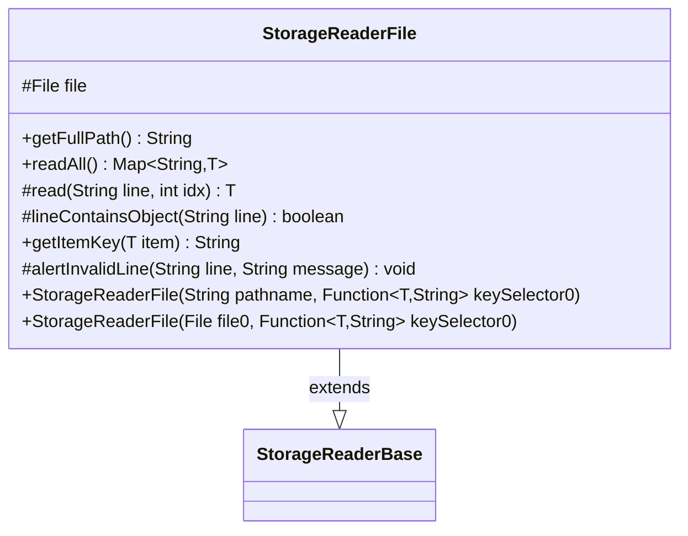

---
aliases:
  - StorageReaderFile
tags:
  - java/class
  - module/forge-core
  - pkg/forge/util/storage
fqn: forge.util.storage.StorageReaderFile
package: forge.util.storage
module: forge-core
kind: Class
---

# StorageReaderFile

**Package:** `forge.util.storage` &nbsp; **Module:** `forge-core` &nbsp; **Kind:** Class



## Relationships
**Extends:**
- [[forge.util.storage.StorageReaderBase|StorageReaderBase]]

## Design Description

Treats each line of a text file as the serialized form of one named object, providing a file-based concrete layer of the storage-reader hierarchy. Extending `StorageReaderBase<T>`, it implements `readAll()` to iterate a file's lines via `FileUtil`, skipping blanks and lines that fail `lineContainsObject` (by default, comment lines beginning with `#`), and delegating the actual parsing of each surviving line to the abstract `read(line, idx)` hook that subclasses must supply.

The class keeps the file-handling and key-management concerns generic while leaving format-specific deserialization to subclasses, a Template Method arrangement. Object keys come from a caller-supplied `keySelector` function, and duplicate keys are tolerated but reported on standard error; `alertInvalidLine` offers subclasses a uniform way to report malformed input. Convenience constructors accept either a pathname or a `File`, decoupling clients from how the location is expressed.

## Source
`forge-core/src/main/java/forge/util/storage/StorageReaderFile.java`

```java
/*
 * Forge: Play Magic: the Gathering.
 * Copyright (C) 2011  Nate
 *
 * This program is free software: you can redistribute it and/or modify
 * it under the terms of the GNU General Public License as published by
 * the Free Software Foundation, either version 3 of the License, or
 * (at your option) any later version.
 *
 * This program is distributed in the hope that it will be useful,
 * but WITHOUT ANY WARRANTY; without even the implied warranty of
 * MERCHANTABILITY or FITNESS FOR A PARTICULAR PURPOSE.  See the
 * GNU General Public License for more details.
 *
 * You should have received a copy of the GNU General Public License
 * along with this program.  If not, see <http://www.gnu.org/licenses/>.
 */
package forge.util.storage;

import forge.util.FileUtil;
import org.apache.commons.lang3.StringUtils;

import java.io.File;
import java.util.Map;
import java.util.function.Function;

/**
 * This class treats every line of a given file as a source for a named object.
 *
 * @param <T>
 *            the generic type
 */
public abstract class StorageReaderFile<T> extends StorageReaderBase<T> {
    protected final File file;

    public StorageReaderFile(final String pathname, final Function<? super T, String> keySelector0) {
        this(new File(pathname), keySelector0);
    }

    public StorageReaderFile(final File file0, final Function<? super T, String> keySelector0) {
        super(keySelector0);
        file = file0;
    }

    @Override
    public String getFullPath() {
        return file.getPath();
    }

    @Override
    public Map<String, T> readAll() {
        final Map<String, T> result = createMap();

        int idx = 0;
        for (String line : FileUtil.readFile(file)) {
            line = line.trim();
            if (line.isEmpty()) {
                continue; //ignore blank or whitespace lines
            }

            if (!lineContainsObject(line)) {
                continue;
            }

            T item = read(line, idx);
            if (item == null) {
                continue;
            }

            idx++;
            String newKey = keySelector.apply(item);
            if (result.containsKey(newKey)) {
                System.err.println("StorageReaderFile: Overwriting an object with key " + newKey);
            }
            result.put(newKey, item);
        }

        return result;
    }

    protected abstract T read(String line, int idx);

    protected boolean lineContainsObject(final String line) {
        return !StringUtils.isBlank(line) && !line.trim().startsWith("#");
    }

    @Override
    public String getItemKey(final T item) {
        return keySelector.apply(item);
    }

    protected void alertInvalidLine(String line, String message) {
        System.err.println(message);
        System.err.println(line);
        System.err.println(file.getPath());
        System.err.println();
    }
}
```

## Python
`forge/util/storage/StorageReaderFile.py`

```python
from forge.util.storage.StorageReaderBase import StorageReaderBase
from forge.util.FileUtil import FileUtil

import os
import sys
from typing import Callable, Optional


class StorageReaderFile(StorageReaderBase):
    """This class treats every line of a given file as a source for a named object.

    @param <T> the generic type
    """

    def __init__(self, pathname_or_file, keySelector0: Callable[[object], str]):
        if isinstance(pathname_or_file, str):
            file0 = pathname_or_file
        else:
            file0 = pathname_or_file
        super().__init__(keySelector0)
        self.file = file0

    def getFullPath(self) -> str:
        return self.file

    def readAll(self) -> dict:
        result = self.createMap()

        idx = 0
        for line in FileUtil.readFile(self.file):
            line = line.strip()
            if not line:
                continue  # ignore blank or whitespace lines

            if not self.lineContainsObject(line):
                continue

            item = self.read(line, idx)
            if item is None:
                continue

            idx += 1
            newKey = self.keySelector(item)
            if newKey in result:
                sys.stderr.write("StorageReaderFile: Overwriting an object with key " + newKey + "\n")
            result[newKey] = item

        return result

    def read(self, line: str, idx: int):
        raise NotImplementedError

    def lineContainsObject(self, line: str) -> bool:
        return bool(line) and not line.strip().startswith("#")

    def getItemKey(self, item) -> str:
        return self.keySelector(item)

    def alertInvalidLine(self, line: str, message: str) -> None:
        sys.stderr.write(message + "\n")
        sys.stderr.write(line + "\n")
        sys.stderr.write(self.file + "\n")
        sys.stderr.write("\n")
```
