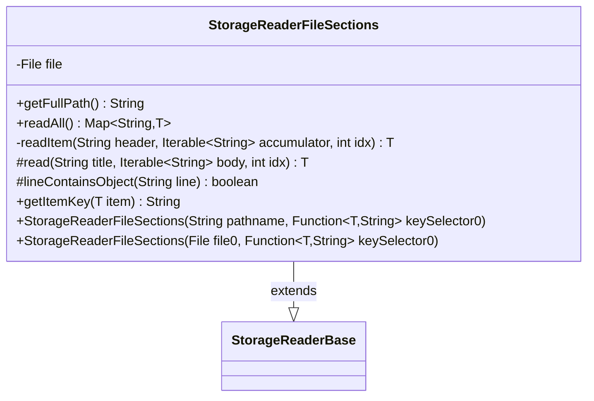

---
aliases:
  - StorageReaderFileSections
tags:
  - java/class
  - module/forge-core
  - pkg/forge/util/storage
fqn: forge.util.storage.StorageReaderFileSections
package: forge.util.storage
module: forge-core
kind: Class
---

# StorageReaderFileSections

**Package:** `forge.util.storage`   **Module:** `forge-core`   **Kind:** Class



## Relationships
**Extends:**
- [[forge.util.storage.StorageReaderBase|StorageReaderBase]]

## Design Description

StorageReaderFileSections is an abstract, generic storage reader that parses a single file into a map of named objects, treating bracket-delimited `[header]` lines as section boundaries and the lines beneath each as that object's body. Extending StorageReaderBase, it implements the IItemReader contract—`readAll`, `getFullPath`, and `getItemKey`—while delegating the actual construction of each item to the abstract `read` hook that concrete subclasses must supply, making it a template-method base for section-structured configuration files. It collaborates with FileUtil for line-by-line reading and a key-selecting Function (inherited as `keySelector`) to derive each item's map key. Notable design intent includes the overridable `lineContainsObject` filter that skips blanks and `#` comments, fail-fast RuntimeException reporting when an item cannot be loaded, and a diagnostic warning when a duplicate key would overwrite an existing entry.

## Source
`forge-core/src/main/java/forge/util/storage/StorageReaderFileSections.java`

```java
/*
 * Forge: Play Magic: the Gathering.
 * Copyright (C) 2011  Nate
 *
 * This program is free software: you can redistribute it and/or modify
 * it under the terms of the GNU General Public License as published by
 * the Free Software Foundation, either version 3 of the License, or
 * (at your option) any later version.
 *
 * This program is distributed in the hope that it will be useful,
 * but WITHOUT ANY WARRANTY; without even the implied warranty of
 * MERCHANTABILITY or FITNESS FOR A PARTICULAR PURPOSE.  See the
 * GNU General Public License for more details.
 *
 * You should have received a copy of the GNU General Public License
 * along with this program.  If not, see <http://www.gnu.org/licenses/>.
 */
package forge.util.storage;

import forge.util.FileUtil;
import org.apache.commons.lang3.StringUtils;

import java.io.File;
import java.util.ArrayList;
import java.util.List;
import java.util.Map;
import java.util.function.Function;

/**
 * This class treats every line of a given file as a source for a named object.
 *
 * @param <T>
 *            the generic type
 */
public abstract class StorageReaderFileSections<T> extends StorageReaderBase<T> {
    private final File file;

    public StorageReaderFileSections(final String pathname, final Function<? super T, String> keySelector0) {
        this(new File(pathname), keySelector0);
    }

    public StorageReaderFileSections(final File file0, final Function<? super T, String> keySelector0) {
        super(keySelector0);
        file = file0;
    }

    @Override
    public String getFullPath() {
        return file.getPath();
    }

    /* (non-Javadoc)
     * @see forge.util.IItemReader#readAll()
     */
    @Override
    public Map<String, T> readAll() {
        final Map<String, T> result = createMap();

        int idx = 0;
        Iterable<String> contents = FileUtil.readFile(file);

        List<String> accumulator = new ArrayList<>();
        String header = null;

        for (final String s : contents) {
            if (!lineContainsObject(s)) {
                continue;
            }

            if (s.charAt(0) == '[') {
                if( header != null ) {
                    // read previously collected item
                    T item = readItem(header, accumulator, idx);
                    if( item != null ) {
                        result.put(keySelector.apply(item), item);
                        idx++;
                    }
                }

                header = StringUtils.strip(s, "[] ");
                accumulator.clear();
            }
            else {
                accumulator.add(s);
            }
        }

        // store the last item
        if (!accumulator.isEmpty()) {
            T item = readItem(header, accumulator, idx);
            if( item != null ) {
                String newKey = keySelector.apply(item);
                if( result.containsKey(newKey))
                    System.err.println("StorageReaderFileSelections: Overwriting an object with key " + newKey);

                result.put(newKey, item);
            }
        }
        return result;
    }

    private T readItem(String header, Iterable<String> accumulator, int idx) {
        final T item = read(header, accumulator, idx);
        if (null != item) return item;

        final String msg = "An object stored in " + file.getPath() + " failed to load.\nPlease submit this as a bug with the mentioned file attached.";
        throw new RuntimeException(msg);
    }

    /**
     * TODO: Write javadoc for this method.
     *
     * @param line
     *            the line
     * @return the t
     */
    protected abstract T read(String title, Iterable<String> body, int idx);

    /**
     * Line contains object.
     *
     * @param line
     *            the line
     * @return true, if successful
     */
    protected boolean lineContainsObject(final String line) {
        return !StringUtils.isBlank(line) && !line.trim().startsWith("#");
    }

    /* (non-Javadoc)
     * @see forge.util.IItemReader#getItemKey(java.lang.Object)
     */
    @Override
    public String getItemKey(final T item) {
        return keySelector.apply(item);
    }
}
```

## Python
`forge/util/storage/StorageReaderFileSections.py`

```python
from forge.util.FileUtil import FileUtil
from forge.util.storage.StorageReaderBase import StorageReaderBase

import os
from abc import abstractmethod
from typing import Callable, Iterable, List, Map, TypeVar

T = TypeVar("T")


class StorageReaderFileSections(StorageReaderBase):
    """
    This class treats every line of a given file as a source for a named object.

    @param <T> the generic type
    """

    def __init__(self, arg0, keySelector0: Callable[[T], str]):
        # Java overloads:
        #   StorageReaderFileSections(String pathname, Function keySelector0)
        #   StorageReaderFileSections(File file0, Function keySelector0)
        # A str pathname is wrapped into a File; a File is used directly.
        if isinstance(arg0, str):
            file0 = File(arg0)
        else:
            file0 = arg0
        super().__init__(keySelector0)
        self.file = file0

    def getFullPath(self) -> str:
        return self.file.getPath()

    def readAll(self) -> dict[str, T]:
        result = self.createMap()

        idx = 0
        contents = FileUtil.readFile(self.file)

        accumulator: List[str] = []
        header = None

        for s in contents:
            if not self.lineContainsObject(s):
                continue

            if s[0] == '[':
                if header is not None:
                    # read previously collected item
                    item = self.readItem(header, accumulator, idx)
                    if item is not None:
                        result[self.keySelector(item)] = item
                        idx += 1

                header = s.strip("[] ")
                accumulator.clear()
            else:
                accumulator.append(s)

        # store the last item
        if accumulator:
            item = self.readItem(header, accumulator, idx)
            if item is not None:
                newKey = self.keySelector(item)
                if newKey in result:
                    import sys
                    print("StorageReaderFileSelections: Overwriting an object with key " + newKey, file=sys.stderr)

                result[newKey] = item
        return result

    def readItem(self, header: str, accumulator: Iterable[str], idx: int) -> T:
        item = self.read(header, accumulator, idx)
        if item is not None:
            return item

        msg = "An object stored in " + self.file.getPath() + " failed to load.\nPlease submit this as a bug with the mentioned file attached."
        raise RuntimeError(msg)

    @abstractmethod
    def read(self, title: str, body: Iterable[str], idx: int) -> T:
        """
        TODO: Write javadoc for this method.

        @param line the line
        @return the t
        """
        ...

    def lineContainsObject(self, line: str) -> bool:
        """
        Line contains object.

        @param line the line
        @return true, if successful
        """
        return line is not None and line.strip() != "" and not line.strip().startswith("#")

    def getItemKey(self, item: T) -> str:
        return self.keySelector(item)
```
