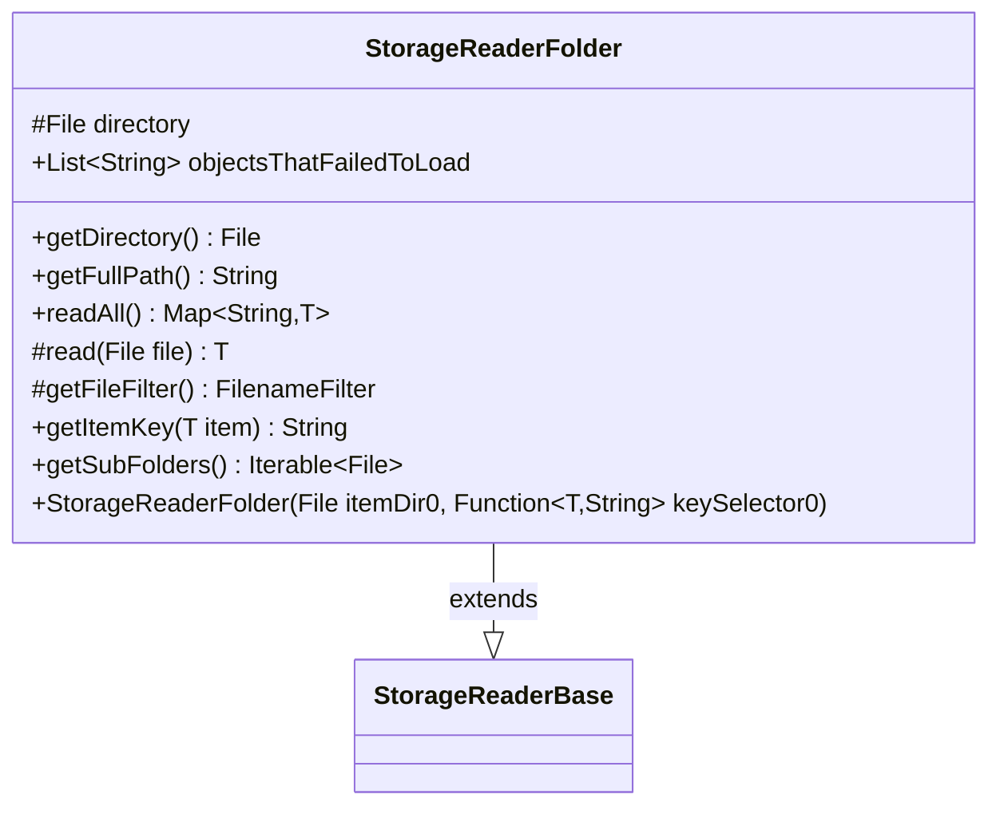

---
aliases:
  - StorageReaderFolder
tags:
  - java/class
  - module/forge-core
  - pkg/forge/util/storage
fqn: forge.util.storage.StorageReaderFolder
package: forge.util.storage
module: forge-core
kind: Class
---

# StorageReaderFolder

**Package:** `forge.util.storage`   **Module:** `forge-core`   **Kind:** Class



## Relationships
**Extends:**
- [[forge.util.storage.StorageReaderBase|StorageReaderBase]]

## Design Description

StorageReaderFolder is an abstract, generic base for storage readers that treat each file in a directory as one named, deserializable object. Extending StorageReaderBase, it manages the backing directory—validating and creating it in the constructor—and implements readAll() to iterate over filter-selected files, deserialize each via the abstract read hook, and build a Name→Object map keyed by the inherited keySelector function. Concrete subclasses supply only the read and getFileFilter logic for their specific item type.

Design intent is visible in its robustness and extensibility: key collisions are disambiguated by appending the filename before warning on overwrite, items that fail to load are collected into objectsThatFailedToLoad rather than aborting the whole read, and optional getSubFolders support lets consumers handle nested directories at their discretion.

## Source
`forge-core/src/main/java/forge/util/storage/StorageReaderFolder.java`

```java
/*
 * Forge: Play Magic: the Gathering.
 * Copyright (C) 2011  Nate
 *
 * This program is free software: you can redistribute it and/or modify
 * it under the terms of the GNU General Public License as published by
 * the Free Software Foundation, either version 3 of the License, or
 * (at your option) any later version.
 *
 * This program is distributed in the hope that it will be useful,
 * but WITHOUT ANY WARRANTY; without even the implied warranty of
 * MERCHANTABILITY or FITNESS FOR A PARTICULAR PURPOSE.  See the
 * GNU General Public License for more details.
 *
 * You should have received a copy of the GNU General Public License
 * along with this program.  If not, see <http://www.gnu.org/licenses/>.
 */
package forge.util.storage;

import forge.util.TextUtil;

import java.io.File;
import java.io.FilenameFilter;
import java.io.IOException;
import java.util.*;
import java.util.function.Function;

/**
 * This class treats every file in the given folder as a source for a named
 * object. The descendant should implement read method to deserialize a single
 * item. So that readAll will return a map of Name => Object as read from disk
 *
 * @param <T> the generic type
 */
public abstract class StorageReaderFolder<T> extends StorageReaderBase<T> {
    /**
     * @return the directory
     */
    public File getDirectory() {
        return directory;
    }

    @Override
    public String getFullPath() {
        return directory.getPath();
    }

    protected final File directory;

    /**
     * Instantiates a new storage reader folder.
     *
     * @param itemDir0 the item dir0
     */
    public StorageReaderFolder(final File itemDir0, Function<? super T, String> keySelector0) {
        super(keySelector0);

        this.directory = itemDir0;

        if (this.directory == null) {
            throw new IllegalArgumentException("No directory specified");
        }
        try {
            if (this.directory.isFile()) {
                throw new IOException("Not a directory");
            } else {
                this.directory.mkdirs();
                if (!this.directory.isDirectory()) {
                    throw new IOException("Directory can't be created");
                }
            }
        } catch (final IOException ex) {
            throw new RuntimeException("StorageReaderFolder.ctor() error, " + ex.getMessage());
        }
    }

    public final List<String> objectsThatFailedToLoad = new ArrayList<>();

    /* (non-Javadoc)
     * @see forge.util.IItemReader#readAll()
     */
    @Override
    public Map<String, T> readAll() {
        final Map<String, T> result = createMap();

        final File[] files = this.directory.listFiles(this.getFileFilter());
        for (final File file : files) {
            try {
                final T newDeck = this.read(file);
                if (null == newDeck) {
                    final String msg = "An object stored in " + file.getPath() + " failed to load.\nPlease submit this as a bug with the mentioned file/directory attached.";
                    throw new RuntimeException(msg);
                }

                String newKey = keySelector.apply(newDeck);
                if (result.containsKey(newKey)) {
                    newKey += "-" + file.getName();
                }
                if (result.containsKey(newKey)) {
                    System.err.println("StorageReaderFolder: Overwriting an object with key " + newKey);
                }
                result.put(newKey, newDeck);
            } catch (final NoSuchElementException ex) {
                final String message = TextUtil.concatWithSpace( file.getName(),"failed to load because ----", ex.getMessage());
                objectsThatFailedToLoad.add(message);
            }
        }
        return result;
    }

    /**
     * Read the object from file.
     *
     * @param file the file
     * @return the object deserialized by inherited class
     */
    protected abstract T read(File file);

    /**
     * TODO: Write javadoc for this method.
     *
     * @return FilenameFilter to pick only relevant objects for deserialization
     */
    protected abstract FilenameFilter getFileFilter();

    @Override
    public String getItemKey(T item) {
        return keySelector.apply(item);
    }

    // methods handling nested folders are provided. It's up to consumer whether to use these or not.
    @Override
    public Iterable<File> getSubFolders() {
        File[] list = this.directory.listFiles(file -> file.isDirectory() && !file.isHidden());
        return Arrays.asList(list);
    }
}
```

## Python
`forge/util/storage/StorageReaderFolder.py`

```python
from forge.util.storage.StorageReaderBase import StorageReaderBase
from forge.util.TextUtil import TextUtil

import os


class StorageReaderFolder(StorageReaderBase):
    """
    This class treats every file in the given folder as a source for a named
    object. The descendant should implement read method to deserialize a single
    item. So that readAll will return a map of Name => Object as read from disk

    @param <T> the generic type
    """

    def getDirectory(self):
        """
        @return the directory
        """
        return self.directory

    def getFullPath(self):
        return self.directory.getPath()

    def __init__(self, itemDir0, keySelector0):
        """
        Instantiates a new storage reader folder.

        @param itemDir0 the item dir0
        """
        super().__init__(keySelector0)

        self.directory = itemDir0

        self.objectsThatFailedToLoad = []

        if self.directory is None:
            raise ValueError("No directory specified")
        try:
            if self.directory.isFile():
                raise IOError("Not a directory")
            else:
                self.directory.mkdirs()
                if not self.directory.isDirectory():
                    raise IOError("Directory can't be created")
        except IOError as ex:
            raise RuntimeError("StorageReaderFolder.ctor() error, " + str(ex))

    def readAll(self):
        """
        (non-Javadoc)
        @see forge.util.IItemReader#readAll()
        """
        result = self.createMap()

        files = self.directory.listFiles(self.getFileFilter())
        for file in files:
            try:
                newDeck = self.read(file)
                if newDeck is None:
                    msg = "An object stored in " + file.getPath() + " failed to load.\nPlease submit this as a bug with the mentioned file/directory attached."
                    raise RuntimeError(msg)

                newKey = self.keySelector.apply(newDeck)
                if newKey in result:
                    newKey += "-" + file.getName()
                if newKey in result:
                    import sys
                    print("StorageReaderFolder: Overwriting an object with key " + newKey, file=sys.stderr)
                result[newKey] = newDeck
            except StopIteration as ex:
                message = TextUtil.concatWithSpace(file.getName(), "failed to load because ----", str(ex))
                self.objectsThatFailedToLoad.append(message)
        return result

    def read(self, file):
        """
        Read the object from file.

        @param file the file
        @return the object deserialized by inherited class
        """
        raise NotImplementedError

    def getFileFilter(self):
        """
        TODO: Write javadoc for this method.

        @return FilenameFilter to pick only relevant objects for deserialization
        """
        raise NotImplementedError

    def getItemKey(self, item):
        return self.keySelector.apply(item)

    # methods handling nested folders are provided. It's up to consumer whether to use these or not.
    def getSubFolders(self):
        list = self.directory.listFiles(lambda file: file.isDirectory() and not file.isHidden())
        return list
```
